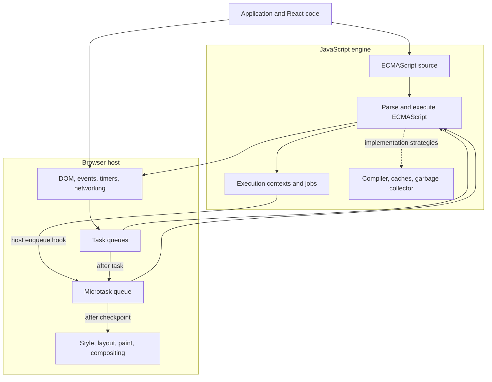

# Chapter 1 — JavaScript Runtime Model

## Learning objectives

After completing this chapter, you should be able to:

- distinguish ECMAScript, engine, host, and framework responsibilities;
- explain what “JavaScript is single-threaded” does and does not mean;
- trace browser code through synchronous evaluation, promise reactions, timers, and a rendering opportunity;
- qualify scheduling claims for browsers and Node.js;
- connect main-thread availability to React responsiveness;
- select the right specification, documentation, or profiler for a runtime question.

## Why This Matters

Many weak answers about promises, timers, rendering, and React share the same flaw: they treat the “JavaScript runtime” as one machine with one universal event loop. That model cannot explain why `document` exists in a browser but not in ECMAScript, why Node.js has `process.nextTick`, why a fulfilled promise still invokes its handler later, or why React can interrupt some render work but cannot interrupt arbitrary synchronous JavaScript.

Interviewers use runtime questions to test whether you can locate responsibility, preserve important qualifications, and predict behavior in a specific environment. The same skills matter when a production interface stops responding: the fix depends on whether the time is spent executing JavaScript, waiting for a host operation, rendering pixels, collecting memory, or repeating framework work.

## Core Mental Model

Treat a running application as four cooperating layers:

1. **ECMAScript defines the language.** It specifies values, objects, functions, execution contexts, realms, and jobs. It also defines host hooks where an embedding environment must participate.
2. **An engine implements ECMAScript.** V8, SpiderMonkey, and JavaScriptCore parse and execute code and may use interpreters, optimizing compilers, garbage collectors, object shapes, and caches. Those strategies are not generally language guarantees.
3. **A host embeds an engine.** A browser supplies the DOM, timers, networking, event dispatch, event loops, and rendering. Node.js supplies filesystem and process APIs and integrates its event loop with libuv.
4. **A framework runs on those facilities.** React decides when to render components, batch updates, commit changes, and prioritize eligible work. It does not redefine ECMAScript or the browser event loop.

A useful interview habit is to finish every runtime claim with an implicit question: **specified by which layer, in which environment?**

This is a conceptual separation, not an assertion that implementations are internally isolated. Browsers and engines integrate closely, Node.js embeds V8 and libuv, and React uses host scheduling facilities. The boundaries identify who owns the observable contract.

## Formal Model

### ECMAScript is designed to be hosted

ECMA-262 specifies the ECMAScript language. It deliberately leaves integration points to a **host environment**. For example, the specification describes host hooks for enqueuing promise jobs, loading modules, reporting rejected promises, and initializing a realm. A browser and Node.js can therefore implement the same language while exposing different globals and scheduling systems.

This gives us an important distinction:

- `Promise`, `Map`, `Array`, and `globalThis` are defined by ECMAScript.
- `document`, `setTimeout`, and `fetch` are supplied by a browser host.
- `process`, `setImmediate`, and filesystem APIs are supplied by Node.js.

Some APIs exist in more than one host—`fetch` and timers are examples—but their presence in multiple environments does not make them ECMAScript features.

### Agent

An ECMAScript **agent** is a specification-level unit containing execution contexts, an execution-context stack, a running execution context, agent state, and an executing thread. Only one ECMAScript job may be actively evaluated in an agent at a time, and a started job runs to completion before another job begins in that agent.

An agent is not guaranteed to correspond one-to-one with an operating-system thread. The specification explicitly treats it as an abstract mechanism. Multiple agents can exist, which matters for workers and shared memory.

Therefore, “JavaScript is single-threaded” is useful only when narrowed to something like this:

> In a typical browser window agent, ordinary JavaScript callbacks do not execute concurrently with one another on the same agent. The surrounding browser is still multi-threaded, and separate workers can execute JavaScript in other agents.

### Realm

A **realm** associates code with a global object, a global environment, and its own set of intrinsic objects. A same-origin iframe provides an observable example: its `Array` constructor and `Array.prototype` are distinct objects from those in its parent realm.

```js
// Browser example; the page contains a same-origin <iframe>.
const frame = document.querySelector('iframe');
const valueFromFrame = new frame.contentWindow.Array();

console.log(Array.isArray(valueFromFrame)); // true
console.log(valueFromFrame instanceof Array); // false
```

`Array.isArray` recognizes the value as an array, but `instanceof Array` follows the current realm's `Array.prototype` chain. Realm boundaries therefore affect identity checks, error classes, and objects exchanged between windows.

### Execution context

An **execution context** is specification state needed to evaluate code. The currently running context belongs to an execution-context stack. Calling an ECMAScript function normally creates and pushes a function execution context; returning removes it and resumes the caller.

An execution context is not a physical stack frame, although an engine will use implementation-level stack and heap structures to realize the specified behavior. Chapter 2 develops this distinction.

### Job

An ECMAScript **job** initiates ECMAScript computation when no other ECMAScript computation is running in the relevant agent. Promise reactions are executed through promise jobs. The specification constrains job execution but delegates scheduling through host hooks such as `HostEnqueuePromiseJob`.

In a browser, the HTML Standard integrates promise jobs with its **microtask queue**. This is why it is usually practical to say that a `.then` handler is a microtask in a browser. The precise layering is:

1. ECMAScript creates a promise reaction job.
2. ECMAScript calls a host hook to enqueue that job.
3. The browser queues and later processes it according to the HTML event-loop rules.

“Job” and “microtask” are related terms from different specifications; they are not universal synonyms.

### Browser task, microtask, and rendering opportunity

The HTML Standard defines browser **event loops**. An event loop has one or more task queues and one microtask queue. Tasks include work such as running a script, dispatching an event, or invoking a timer callback. After a task completes and the JavaScript execution-context stack is empty, the browser can perform a microtask checkpoint. It drains runnable microtasks, including microtasks added by other microtasks, before moving on.

Updating rendering is a separate step in the event-loop processing model. A DOM mutation changes browser-maintained state, but pixels do not have to update immediately at that line of JavaScript. The browser may update rendering after the current task and its microtask checkpoint, subject to the standard's rendering conditions and the user agent's scheduling decisions.

This chapter uses “may have a rendering opportunity” deliberately. It does not promise a paint after every task.

## Visual Model



The arrows describe responsibility and handoff, not a complete browser architecture. In particular, browsers may perform networking, rasterization, garbage collection, and other work on additional threads.

## Step-by-Step Runtime Walkthrough

Run this in a browser page with an element matching `<button id="save">Save</button>`:

```js
const saveButton = document.querySelector('#save');

saveButton.addEventListener('click', () => {
  console.log('handler: start');
  saveButton.textContent = 'Saving…';

  Promise.resolve().then(() => {
    console.log('promise reaction');
    saveButton.dataset.status = 'pending';
  });

  setTimeout(() => {
    console.log('timer callback');
    saveButton.textContent = 'Saved';
  }, 0);

  console.log('handler: end');
});
```

Before reading further, predict the console order and when the user can observe each text change.

For one click, the console order is:

```text
handler: start
handler: end
promise reaction
timer callback
```

The runtime sequence is:

1. **Browser event dispatch:** The browser obtains a task that dispatches the click event and invokes the registered callback.
2. **Synchronous ECMAScript execution:** The engine creates the callback's execution context. `handler: start` is logged, and assigning `textContent` changes the DOM state. That assignment does not force an immediate screen paint.
3. **Promise scheduling:** `Promise.resolve()` creates an already-fulfilled promise. Calling `.then` creates reaction records. Because the promise is fulfilled, ECMAScript asks the host to enqueue a promise reaction job. The browser integrates that job as a microtask.
4. **Timer scheduling:** `setTimeout` is a browser API. A delay of `0` is a minimum scheduling threshold, not a command to invoke the callback immediately. The callback can run only in a later task.
5. **Handler completion:** `handler: end` is logged. The callback returns, its execution context is removed, and the click task approaches completion.
6. **Microtask checkpoint:** The browser performs a microtask checkpoint. The promise reaction runs, logs its message, and changes `data-status`. It runs before the timer task.
7. **Potential rendering update:** With the task complete and microtasks drained, the browser may update rendering. If it does, the user can see `Saving…`.
8. **Timer task:** Once eligible and selected, a later task invokes the timer callback, which logs and changes the text to `Saved`.
9. **Later rendering opportunity:** The browser may render the final text after that task and its microtasks complete.

There is an important qualification: a fast browser is not required to visibly paint the intermediate `Saving…` state. Rendering opportunities and display refresh timing can allow the two changes to be presented together. Console ordering is more constrained here than visible paint timing.

## Progressive Examples

### Foundational: synchronous calls and a promise job

This example uses ECMAScript APIs and `console`, which is host-provided but does not influence the ordering being demonstrated.

```js
function calculateTotal() {
  console.log('calculate');
  return 42;
}

console.log('start');

Promise.resolve().then(() => {
  console.log('promise');
});

console.log(calculateTotal());
console.log('end');
```

Predict the output before revealing it:

```text
start
calculate
42
end
promise
```

Calling `calculateTotal` is synchronous: its function execution context is pushed and completed before the next top-level statement. The promise is already fulfilled, but the reaction handler is still scheduled as a job rather than called inline. “Settled” describes promise state; it does not mean “handler has run.”

### Production-oriented: yielding is not automatic

```html
<button id="generate-report">Generate report</button>
<p id="status">Idle</p>

<script>
  const button = document.querySelector('#generate-report');
  const status = document.querySelector('#status');

  button.addEventListener('click', () => {
    status.textContent = 'Working…';

    const startedAt = performance.now();
    while (performance.now() - startedAt < 2_000) {
      // Simulates CPU-heavy synchronous application work.
    }

    status.textContent = 'Complete';
  });
</script>
```

The user will probably never see `Working…`. Both DOM writes occur during the same task, while the main thread is occupied by JavaScript. The browser cannot invoke other main-thread callbacks during that execution, and it does not normally update rendering in the middle of the task.

Moving the loop into a promise handler does not solve the responsiveness problem. Microtasks still run on the main thread, and a long microtask delays rendering. Real options depend on the work:

- split it into bounded chunks and yield between them;
- move CPU-heavy computation to a Web Worker;
- reduce or avoid the computation;
- perform suitable work on a server;
- use scheduling APIs with explicit responsiveness goals.

The correct choice requires measurement. “Make it async” is not a performance strategy because `async` functions and promises do not move CPU work to another thread.

### Interview edge case: browser vocabulary is not Node.js vocabulary

Run this as a Node.js script:

```js
console.log('start');

setTimeout(() => console.log('timeout'), 0);
Promise.resolve().then(() => console.log('promise'));
process.nextTick(() => console.log('nextTick'));

console.log('end');
```

In current Node.js releases, the output is:

```text
start
end
nextTick
promise
timeout
```

The synchronous script finishes first. Node.js drains its `process.nextTick` queue before the promise microtask queue, and the timer callback runs later through the Node.js event-loop machinery.

Do not generalize `process.nextTick` to browsers; it is a Node.js API. Also avoid claiming a universal ordering between `setTimeout(..., 0)` and `setImmediate()` from a main module. Node.js documents that their relative order in that context can vary, while their ordering inside an I/O callback has a stronger guarantee. Node.js event-loop behavior can also change across versions—for example, the timers phase changed with libuv 1.45.0 in Node.js 20.

## Common Misconceptions

### “The event loop is part of JavaScript”

ECMAScript defines jobs and host hooks, but it does not define one universal browser-style event loop. The HTML Standard defines browser event loops; Node.js defines its own integration and phases. Say which environment you mean.

### “JavaScript is single-threaded” fully describes concurrency

It describes an important restriction for code executing within one typical agent, but it omits the rest of the runtime. Browsers can perform work on other threads, and workers can execute JavaScript in separate agents. Shared memory and atomics make cross-agent coordination observable.

### “Web APIs run inside the JavaScript engine”

Browser APIs are host facilities. The engine executes JavaScript callbacks associated with them, while the browser owns DOM, networking, timers, rendering, and event-loop integration. Their implementations can be tightly integrated without becoming ECMAScript features.

### “Promises are browser APIs”

Promises and their resolution algorithms are defined by ECMAScript. Hosts determine how promise jobs are enqueued. Browsers connect them to microtasks; Node.js integrates them with its own scheduling machinery.

### “A zero-millisecond timeout runs immediately”

The delay is a threshold. The current code must finish, and the host must select the timer callback in a later scheduling turn. Clamping, other queued work, and an occupied thread can add delay.

### “Promises move work off the main thread”

A promise organizes eventual results. Its executor runs synchronously when the promise is constructed, and its reaction handlers execute as JavaScript on the relevant agent. Only a host operation or another worker/process provides actual parallel execution.

### “React concurrent rendering executes components in parallel”

React can prioritize, pause, resume, or abandon eligible rendering work. That is cooperative framework scheduling, not simultaneous execution of component functions on multiple threads. A long synchronous event handler still blocks the main thread.

## React Connection

React code remains JavaScript executed by an engine inside a host. Three consequences matter immediately.

First, **rendering a component is JavaScript work**. If a render path performs expensive synchronous computation, the main thread cannot handle input or paint during that uninterrupted work. Memoization may reduce repeated work, but it does not change the runtime boundary.

Second, **render and browser paint are different events**. React's render phase calculates what the UI should become. During commit, React applies changes to the host environment, such as DOM mutations. The browser decides when pixels are produced. “React rendered” can therefore mean component evaluation, DOM commit, or visible paint; strong explanations name the phase.

Third, **React scheduling cannot preempt arbitrary JavaScript**. React can arrange eligible framework work in smaller units and assign priorities, but control must return to its scheduler. Consider:

```jsx
function SearchButton() {
  const [status, setStatus] = React.useState('Idle');

  function handleClick() {
    setStatus('Working');

    const startedAt = performance.now();
    while (performance.now() - startedAt < 2_000) {
      // Blocks the browser main thread and React's scheduler.
    }

    setStatus('Done');
  }

  return <button onClick={handleClick}>{status}</button>;
}
```

React may batch both state updates. More fundamentally, the handler does not yield for two seconds. Wrapping the CPU loop in a transition or an `async` function does not make it parallel. The computation must be reduced, chunked with suitable yielding, or moved to a worker if it is inherently CPU-heavy.

Later chapters will distinguish render and commit phases, automatic batching, transitions, and concurrent rendering in detail.

## Performance and Memory Implications

Runtime layers suggest different evidence and remedies:

| Symptom | Likely layer to inspect | Useful evidence |
| --- | --- | --- |
| Long uninterrupted callback | Application or framework JavaScript | Performance trace, bottom-up CPU profile, call tree |
| Slow network completion | Browser/Node.js host and network | Network timing, server timing, request waterfall |
| DOM change but delayed pixels | Main-thread scheduling or rendering pipeline | Performance trace with style, layout, paint, and screenshots |
| Repeated React component work | React update and identity behavior | React Profiler correlated with a browser trace |
| Increasing memory with retained objects | Application references, framework subscriptions, or host objects | Heap snapshots and retaining paths |
| Garbage-collection pauses | Engine implementation under a particular allocation pattern | GC events and allocation profiling |

Do not infer the cause from wall-clock duration alone. A function awaiting a fetch may span seconds while consuming little CPU. Conversely, a 100 ms synchronous callback can seriously delay input and rendering.

The ECMAScript run-to-completion rule also has a responsiveness cost: one job is not interleaved with another job in the same agent. This simplifies local reasoning but allows long work to monopolize that agent. Microtasks need the same discipline; recursively adding microtasks can delay tasks and rendering.

Memory ownership crosses layers as well. A JavaScript listener can retain application objects, a DOM node can retain host-side structures, and React subscriptions can keep callbacks reachable. Heap analysis should follow actual retaining paths instead of attributing a leak to “the browser” or “closures” in general.

## Debugging Techniques

### Classify a slow browser interaction

1. Open Chrome DevTools and select **Performance**.
2. Enable screenshots when visible UI timing matters.
3. Record while reproducing exactly one slow interaction.
4. Locate the input event and its main-thread task.
5. Expand the call tree to distinguish application functions, React work, style calculation, layout, paint, and garbage collection.
6. Compare DOM commits or style changes with screenshot frames; they need not occur at the same timestamp.
7. Inspect the **Bottom-up** view to find aggregate CPU cost rather than blaming the longest-looking async span.

A “Long task” marker says the main thread was occupied for a substantial interval; it does not by itself identify the responsible function or layer.

### Preserve asynchronous causality

Chrome DevTools can show async stack traces linking a callback to where it was scheduled. This is valuable for timers, promise chains, and event callbacks, but the displayed stack is diagnostic metadata rather than one continuously retained synchronous call stack.

Add User Timing marks around application phases when names in a trace are ambiguous:

```js
performance.mark('search-filter:start');
const filteredItems = filterItems(items, query);
performance.mark('search-filter:end');
performance.measure(
  'search-filter',
  'search-filter:start',
  'search-filter:end',
);
```

Measure in a representative build and workload. Development-mode React diagnostics can intentionally add work and should not be treated as production timings.

### Debug Node.js separately

Use the Node.js inspector or CPU profiles for server-side JavaScript. Do not interpret Node traces using browser rendering concepts. Check the deployed Node and libuv versions before relying on fine-grained phase ordering.

## Interview Questions

### Level 1 — Fundamentals

**Question:** What is the JavaScript runtime?

**Model answer:**

A JavaScript runtime is the complete environment that executes JavaScript, not just the language engine. ECMAScript defines language semantics such as objects, functions, execution contexts, and promise jobs. An engine such as V8 implements those semantics. A host embeds the engine and supplies facilities such as the browser DOM and event loop or Node.js filesystem APIs and libuv integration. In a frontend application, React adds another scheduling and rendering layer. I qualify the term because browser and Node.js runtimes share ECMAScript but do not have identical APIs or event-loop behavior.

### Level 2 — Applied understanding

**Question:** Why does a fulfilled promise's `.then` handler not run immediately, while the promise executor does?

**Model answer:**

The `Promise` constructor calls its executor synchronously as part of constructing the promise. A reaction passed to `.then` is different: ECMAScript represents it as work to run through a promise job, even if the promise is already fulfilled. The host enqueues that job; in a browser it is processed as a microtask after the current synchronous work finishes. This preserves run-to-completion, so a `.then` handler cannot interrupt the code that registered it. The qualification is that “microtask” describes the browser integration; the ECMAScript term is a promise reaction job.

### Level 3 — Senior reasoning

**Question:** A click handler updates a spinner, performs 800 ms of synchronous work, and then hides the spinner. Why may the spinner never appear, and what would you change?

**Model answer:**

Both DOM updates and the computation happen in one browser task. The DOM state changes, but the browser normally cannot update rendering while that main-thread JavaScript is still running. By the next rendering opportunity, the spinner may already be hidden. I would first profile to confirm the CPU cost. Then I would reduce the work, split it into bounded chunks that yield back to the host, or move CPU-heavy computation to a worker. Putting the same loop in a promise handler would not help because microtasks also execute on the main thread and can delay rendering.

### Level 4 — Deep follow-up

**Question:** Does ECMAScript guarantee that promise callbacks run before `setTimeout(..., 0)` callbacks?

**Model answer:**

Not as a standalone cross-host statement. ECMAScript defines promise jobs and asks the host to enqueue them, but `setTimeout` is not an ECMAScript API. In a browser, the HTML Standard integrates promise jobs as microtasks and timer callbacks as tasks, so after the current task a microtask checkpoint runs before the later timer task. Node.js also prioritizes promise microtasks relative to timers, but it has additional queues such as `process.nextTick` and version-specific event-loop details. I would state the ordering only after naming the host and the scheduling context.

## Exercises

### 1. Classify responsibility

Assign the primary owner of each concept: ECMAScript, engine implementation, browser host, Node.js host, or React.

1. Promise resolution procedure
2. Hidden classes
3. DOM event dispatch
4. `process.nextTick`
5. State update batching
6. Execution contexts
7. Paint and compositing

<details>
<summary>Solution</summary>

1. ECMAScript
2. Engine implementation; “hidden class” is common V8 terminology, not an ECMAScript guarantee
3. Browser host, specified primarily by DOM and HTML standards
4. Node.js host
5. React
6. ECMAScript
7. Browser host

</details>

### 2. Predict browser output

Predict the result before opening the solution:

```js
console.log('A');

setTimeout(() => console.log('B'), 0);

Promise.resolve()
  .then(() => {
    console.log('C');
    queueMicrotask(() => console.log('D'));
  })
  .then(() => console.log('E'));

console.log('F');
```

<details>
<summary>Solution</summary>

```text
A
F
C
D
E
B
```

The initial task logs `A` and `F`. The first promise reaction is the first microtask and logs `C`. It queues the `D` microtask and then completes, fulfilling the promise returned by the first `.then`; that fulfillment queues the second reaction that logs `E`. The microtask queue is FIFO here, so `D` precedes `E`. The timer callback runs in a later task.

</details>

### 3. Repair the explanation

Identify every important problem in this statement:

> JavaScript's event loop sends asynchronous Web APIs to the microtask queue. Once the call stack is empty, it runs the entire microtask queue in parallel, paints the page, and then executes `setTimeout` exactly at the requested delay.

<details>
<summary>Solution</summary>

- There is no universal “JavaScript event loop”; browsers and Node.js provide host-specific scheduling.
- Web APIs are not all microtasks. Browser operations can ultimately queue tasks, microtasks, or use other specification mechanisms.
- Microtasks execute one at a time on the relevant agent, not in parallel.
- A microtask checkpoint can keep draining newly added microtasks, which can delay rendering.
- The browser is not required to paint after every checkpoint; rendering depends on whether an update is due and other user-agent conditions.
- A timeout delay is a minimum threshold. It does not guarantee an exact callback time.

</details>

### 4. Diagnose a React interaction

A React search screen calls `startTransition`, then synchronously sorts 500,000 records before calling the transition's state setter. Typing still freezes. Explain why and propose a correction.

<details>
<summary>Solution</summary>

`startTransition` marks eligible React state updates as non-urgent; it does not move arbitrary synchronous computation to another thread. The sort occurs before the state setter and monopolizes the main thread, so browser input and React scheduling cannot proceed. Profile first, then avoid repeated sorting, use a more appropriate data strategy, process bounded chunks with deliberate yielding, or move the computation to a Web Worker. After the result becomes available, a transition may still be useful for the resulting non-urgent render.

</details>

### 5. Spoken explanation

In no more than 45 seconds, explain why “JavaScript is single-threaded” is both useful and incomplete. Your answer should mention agents, host work, and workers without claiming that an agent is always an operating-system thread.

## Chapter Summary

- **Essential model:** ECMAScript defines language semantics; an engine implements them; a host provides APIs and scheduling; a framework adds higher-level policy.
- **Important distinctions:** job versus microtask, DOM mutation versus paint, execution context versus engine stack frame, and concurrency versus parallel JavaScript execution.
- **Mistakes to avoid:** treating the browser event loop as ECMAScript, assuming promises create threads, promising exact timer timing, or describing React concurrency as parallel component execution.
- **Debugging principle:** identify the responsible layer and collect evidence from the profiler designed for that layer.

### Interview-ready explanation

A JavaScript runtime combines the ECMAScript language, an engine, and a host environment. ECMAScript defines execution semantics and jobs; an engine such as V8 implements them; a browser or Node.js supplies APIs and decides how scheduled work integrates with its event loop. In a browser, callbacks on one agent run to completion, promise jobs are integrated as microtasks, and rendering is host work that happens only when JavaScript yields and the browser has a rendering opportunity. React runs inside those constraints: it can schedule eligible render work cooperatively, but it cannot make arbitrary synchronous JavaScript parallel or preempt a blocking handler.

## Further Reading

- [ECMA-262: Overview](https://tc39.es/ecma262/#sec-overview)
- [ECMA-262: Realms](https://tc39.es/ecma262/#sec-code-realms)
- [ECMA-262: Jobs and Host Operations to Enqueue Jobs](https://tc39.es/ecma262/#sec-jobs-and-host-operations-to-enqueue-jobs)
- [ECMA-262: Agents](https://tc39.es/ecma262/#sec-agents)
- [WHATWG HTML: Event loops](https://html.spec.whatwg.org/multipage/webappapis.html#event-loops)
- [WHATWG DOM: Dispatching events](https://dom.spec.whatwg.org/#concept-event-dispatch)
- [Node.js: The Node.js Event Loop](https://nodejs.org/en/learn/asynchronous-work/event-loop-timers-and-nexttick)
- [React: Render and Commit](https://react.dev/learn/render-and-commit)
- [React: State as a Snapshot](https://react.dev/learn/state-as-a-snapshot)
- [React: `useTransition`](https://react.dev/reference/react/useTransition)
- [V8 documentation](https://v8.dev/docs)
