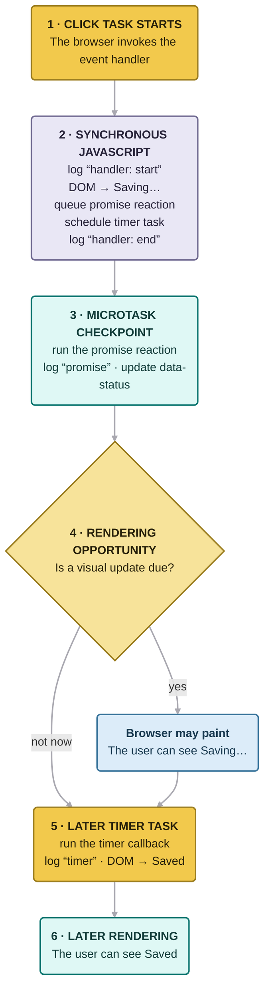

# Chapter 1 — JavaScript Runtime Model

## Learning objectives

After completing this chapter, you should be able to:

- distinguish ECMAScript, engine, host, and framework responsibilities;
- explain what “JavaScript is single-threaded” does and does not mean;
- trace browser code through synchronous execution, microtasks, tasks, and rendering opportunities;
- explain why promises and `async` functions do not make CPU-heavy work parallel;
- connect main-thread availability to browser and React responsiveness.

## Quick Refresher

- A JavaScript runtime combines the ECMAScript language, an engine, and a host environment.
- ECMAScript defines language semantics; it does not define one universal event loop.
- A browser and Node.js implement the same language but provide different APIs and scheduling systems.
- Code running in one typical browser agent runs to completion before another callback runs in that agent.
- Browsers integrate promise reactions with the microtask queue; timer callbacks run as later tasks.
- Changing the DOM does not mean pixels change immediately. The browser must reach a rendering opportunity.
- Promises, `async` functions, and React transitions do not move CPU-heavy JavaScript to another thread.

## Why This Matters

Many weak interview answers treat JavaScript, V8, browser APIs, the event loop, and React as one machine. That model cannot explain why `document` is available in a browser but absent from ECMAScript, why a fulfilled promise still invokes its handler later, or why a React update may change the DOM before the user sees new pixels.

A senior engineer should be able to locate responsibility. When an interface freezes, the remedy depends on whether the application is executing JavaScript, waiting for a host operation, performing rendering work, or repeating framework work.

## Core Mental Model

Treat a frontend application as four cooperating layers:

| Layer          | Responsibility                                  | Examples                                             |
| -------------- | ----------------------------------------------- | ---------------------------------------------------- |
| **ECMAScript** | Defines the language's observable semantics     | Functions, promises, execution contexts, jobs        |
| **Engine**     | Implements and optimizes ECMAScript             | V8, SpiderMonkey, JavaScriptCore, garbage collection |
| **Host**       | Supplies APIs, scheduling, and rendering        | DOM, timers, networking, browser event loops         |
| **Framework**  | Adds application-level scheduling and UI policy | React rendering, batching, transitions               |

The boundaries describe who owns a contract, not physically isolated software. Browsers and engines integrate closely, and React uses browser facilities. Still, the distinction prevents claims such as “JavaScript's event loop paints the page.”

A useful interview habit is to ask: **specified by which layer, in which environment?**

## Formal Model

### ECMAScript is hosted

ECMA-262 defines the language and provides hooks where a host must participate. This is why browser and Node.js runtimes can implement the same language while exposing different globals and scheduling behavior.

- `Promise`, `Array`, `Map`, and `globalThis` are defined by ECMAScript.
- `document`, browser timers, and browser rendering are host facilities.
- `process`, `setImmediate`, and filesystem APIs are Node.js facilities.

An API appearing in several hosts does not make it part of ECMAScript. For example, browsers and modern Node.js versions both expose `fetch`, but each host supplies it.

### Agent and run-to-completion

An ECMAScript **agent** is a specification-level unit that executes ECMAScript jobs. Only one job is actively evaluated in an agent at a time, and a started job runs to completion before another begins in that agent.

This gives a precise version of “JavaScript is single-threaded”:

> In a typical browser window agent, ordinary JavaScript callbacks do not execute concurrently with one another. The browser can still use other threads, and workers can execute JavaScript in separate agents.

An agent is an abstract specification mechanism, not a promise of a one-to-one relationship with an operating-system thread.

### Job, task, microtask, and rendering

These terms belong to different layers:

| Term                      | Meaning in this chapter                                                                             |
| ------------------------- | --------------------------------------------------------------------------------------------------- |
| **Job**                   | An ECMAScript unit of work; promise reactions run as jobs                                           |
| **Task**                  | Browser-scheduled work such as running a script, dispatching an event, or invoking a timer callback |
| **Microtask**             | Browser scheduling used for promise reactions and `queueMicrotask` callbacks                        |
| **Rendering opportunity** | A point when the browser may update style, layout, and pixels                                       |

**What about macrotasks?** “Macrotask” is a widely used informal name for a browser task, usually used to contrast tasks with microtasks. The HTML Standard uses **task**, not macrotask. In an interview, it is fine to say “macrotask” if you clarify that you mean an HTML task, such as event dispatch or a timer callback.

When a promise reaction becomes runnable, ECMAScript asks the host to enqueue its job. A browser integrates that job into its microtask queue. After a task finishes, the browser performs a microtask checkpoint and drains runnable microtasks, including newly added ones, before selecting another task.

Rendering is separate. A DOM mutation changes browser-maintained state, but JavaScript normally must yield before the browser can present that change. Even then, a paint is not guaranteed after every task; rendering depends on browser scheduling and display timing.

Two additional terms appear throughout the handbook:

- An **execution context** is specification state used while evaluating code. It is related to, but not identical to, a physical engine stack frame.
- A **realm** provides a global object, a global environment, and its own intrinsic objects. This is why values from another window can pass `Array.isArray` while failing `instanceof Array` in the current realm.

Chapters 2–4 develop execution contexts, stacks, realms, and environments in detail.

## Visual Model



Read from top to bottom. The current click task runs to completion before the promise reaction. The browser then reaches a possible rendering opportunity before running the timer in a later task. The “not now” path explains why the intermediate `Saving…` state is not guaranteed to appear.

This is a reasoning model, not a complete browser architecture. Networking, rasterization, garbage collection, and other browser work may involve additional threads.

## Step-by-Step Runtime Walkthrough

Run this in a browser page containing `<button id="save">Save</button>`:

```js
const button = document.querySelector("#save");

button.addEventListener("click", () => {
  console.log("handler: start");
  button.textContent = "Saving…";

  Promise.resolve().then(() => {
    console.log("promise");
    button.dataset.status = "pending";
  });

  setTimeout(() => {
    console.log("timer");
    button.textContent = "Saved";
  }, 0);

  console.log("handler: end");
});
```

For one click, the console order is:

```text
handler: start
handler: end
promise
timer
```

Trace it by ownership and scheduling:

1. **The browser dispatches the click as a task.** It invokes the registered JavaScript callback.
2. **The callback runs synchronously.** It logs `handler: start` and changes DOM state to `Saving…`. The browser has not necessarily painted that state.
3. **`.then` schedules later work.** The promise is already fulfilled, but its reaction is not called inline. ECMAScript creates a promise reaction job, which the browser queues as a microtask.
4. **`setTimeout` schedules a later task.** A delay of `0` is a minimum threshold, not an instruction to run immediately.
5. **The handler finishes.** It logs `handler: end` and returns. No other callback interrupted it.
6. **The browser drains microtasks.** The promise reaction logs `promise` and changes `data-status`.
7. **The browser may render.** If a rendering update occurs now, the user can see `Saving…`.
8. **A later task runs the timer callback.** It logs `timer` and changes the text to `Saved`.

The console order is constrained, but the intermediate paint is not. A browser may present only `Saved` if no visible frame occurs between the two DOM changes.

### Why “make it async” does not prevent blocking

Now place expensive synchronous work in the handler:

```js
button.addEventListener("click", () => {
  button.textContent = "Working…";

  const startedAt = performance.now();
  while (performance.now() - startedAt < 2_000) {
    // CPU-heavy application work
  }

  button.textContent = "Complete";
});
```

The user may never see `Working…`: both writes occur in one task, and the main thread cannot paint while the loop is running. Moving the loop into `.then` or an `async` function still executes it on the same agent. Depending on the workload, the real options are to reduce the computation, split it into bounded chunks that yield, move it to a Web Worker, or perform it elsewhere.

### Browser claims do not automatically apply to Node.js

Node.js adds scheduling facilities such as `process.nextTick` and event-loop phases implemented with libuv. Fine-grained ordering can also depend on Node.js and libuv versions. A good interview answer therefore says “in a browser” or “in Node.js” before making scheduling guarantees.

## Common Misconceptions

| Claim                                               | Better explanation                                                                                                |
| --------------------------------------------------- | ----------------------------------------------------------------------------------------------------------------- |
| “The event loop is part of JavaScript.”             | ECMAScript defines jobs and host hooks; browsers and Node.js provide different event-loop integrations.           |
| “Web APIs run inside the engine.”                   | The host owns DOM, timers, networking, and rendering; the engine executes associated JavaScript callbacks.        |
| “A fulfilled promise calls `.then` immediately.”    | Fulfillment is promise state. The reaction still runs later as a job, integrated as a microtask in browsers.      |
| “A zero-delay timer runs immediately.”              | Its callback can run only in a later task after the current work and eligible microtasks.                         |
| “Promises move work to another thread.”             | Promises represent eventual results; their executors and reactions still run as JavaScript on the relevant agent. |
| “React concurrent rendering is parallel rendering.” | React cooperatively schedules eligible work; it cannot preempt arbitrary synchronous JavaScript.                  |

## React Connection

React runs inside the same host constraints:

- **Render is JavaScript work.** Expensive component evaluation occupies the main thread.
- **Commit is not paint.** React may mutate the DOM during commit; the browser decides when pixels appear.
- **Scheduling requires a yield.** React cannot interrupt a long event handler or CPU loop that does not return control.

```jsx
function SearchButton() {
  const [status, setStatus] = React.useState("Idle");

  function handleClick() {
    setStatus("Working");

    const startedAt = performance.now();
    while (performance.now() - startedAt < 2_000) {
      // Blocks input, paint, and React scheduling.
    }

    setStatus("Done");
  }

  return <button onClick={handleClick}>{status}</button>;
}
```

React may batch the state updates, but the deeper problem is that the handler monopolizes the main thread. A transition changes the priority of eligible React updates; it does not move the loop to another thread.

## Performance and Memory Implications

Use the runtime layers to choose evidence rather than guessing from elapsed time:

| Symptom                        | Inspect                            | Useful evidence                                  |
| ------------------------------ | ---------------------------------- | ------------------------------------------------ |
| Long callback or frozen input  | Application/framework JavaScript   | Browser Performance trace and CPU profile        |
| Slow network completion        | Host and network                   | Request waterfall and server timing              |
| DOM updated but pixels delayed | Main thread and rendering pipeline | Style, layout, paint, and screenshots in a trace |
| Repeated component work        | React                              | React Profiler correlated with a browser trace   |
| Increasing retained memory     | Actual reference graph             | Heap snapshots and retaining paths               |

A function awaiting a request may span seconds while consuming little CPU; a 100 ms synchronous callback may visibly delay input. Microtasks can also harm responsiveness if they continually enqueue more microtasks and prevent the browser from reaching tasks or rendering.

## Debugging Techniques

For a slow browser interaction:

1. Record one representative interaction in the browser Performance panel.
2. Locate the input task and inspect its call tree.
3. Separate JavaScript, React, style, layout, paint, and garbage-collection work.
4. Compare DOM changes with screenshot frames when visible timing matters.
5. Use the Bottom-up view to find aggregate CPU cost.
6. Confirm findings in a representative production build; development diagnostics can add work.

A “long task” marker identifies blocked main-thread time, not its cause. Async stack traces can connect a callback to where it was scheduled, but they are diagnostic metadata—not one continuously retained synchronous call stack.

For Node.js, use Node's inspector and profiles, and verify the deployed Node.js version before relying on detailed phase ordering.

## Interview Questions

### Level 1 — Fundamentals

**Question:** What is a JavaScript runtime?

**Model answer:**

A JavaScript runtime is the complete environment that executes JavaScript. ECMAScript defines language semantics, an engine implements them, and a host supplies APIs and scheduling. A browser provides the DOM, rendering, and browser event loops; Node.js provides a different host environment. Frameworks such as React run within those constraints.

### Level 2 — Applied understanding

**Question:** Why does a fulfilled promise's `.then` handler run later while the promise executor runs synchronously?

**Model answer:**

The constructor calls the executor while creating the promise. A `.then` callback is a reaction: ECMAScript schedules it as a promise job even when the promise is already fulfilled. In a browser, the host integrates that job as a microtask, so it runs only after current synchronous execution finishes.

### Level 3 — Senior reasoning

**Question:** A click handler shows a spinner, performs 800 ms of synchronous work, and hides the spinner. Why may the spinner never appear?

**Model answer:**

Both DOM changes and the computation occur in one task. The DOM state changes, but the browser cannot normally paint while the handler occupies the main thread. By the next rendering opportunity, the spinner is already hidden. I would profile first, then reduce the work, deliberately yield between bounded chunks, or move CPU-heavy computation to a worker. A promise or transition alone would not solve the blocking.

### Level 4 — Deep follow-up

**Question:** Does ECMAScript guarantee that promise callbacks run before `setTimeout(..., 0)` callbacks?

**Model answer:**

Not as a universal cross-host statement. ECMAScript defines promise jobs, but `setTimeout` is a host API. In browsers, promise reactions are microtasks and timer callbacks are tasks, so the relevant microtask checkpoint precedes a later timer task. Other hosts have their own scheduling integrations, so the environment must be named.

## Exercises

### 1. Predict browser output

```js
console.log("A");

setTimeout(() => console.log("B"), 0);

Promise.resolve()
  .then(() => {
    console.log("C");
    queueMicrotask(() => console.log("D"));
  })
  .then(() => console.log("E"));

console.log("F");
```

<details>
<summary>Solution</summary>

The output is `A`, `F`, `C`, `D`, `E`, `B`. The initial task logs `A` and `F`. The first reaction logs `C`, queues `D`, and then causes the next promise reaction to be queued. The microtask queue is FIFO here, so `D` precedes `E`. The timer runs in a later task.

</details>

### 2. Repair the explanation

Identify the problems:

> JavaScript's event loop sends Web APIs to the microtask queue, runs microtasks in parallel when the stack is empty, paints, and then executes timers at their requested delays.

<details>
<summary>Solution</summary>

- There is no universal JavaScript event loop; scheduling is host-specific.
- Web APIs do not all produce microtasks.
- Microtasks execute one at a time in the relevant agent, not in parallel.
- A browser is not required to paint after every microtask checkpoint.
- A timer delay is a minimum threshold, not an exact execution time.

</details>

### 3. Diagnose a React interaction

A React search screen calls `startTransition`, synchronously sorts 500,000 records, and then calls the transition's state setter. Typing still freezes. Explain why and propose a correction.

<details>
<summary>Solution</summary>

`startTransition` marks eligible state updates as non-urgent; it does not move arbitrary computation to another thread. The sort monopolizes the main thread before the state update. Profile it, then avoid repeated sorting, process bounded chunks with deliberate yielding, or move the work to a Web Worker. A transition may still help prioritize the render after the result is available.

</details>

## Chapter Summary

- **Responsibility:** ECMAScript defines semantics, an engine implements them, a host supplies APIs and scheduling, and React adds framework policy.
- **Scheduling:** in a browser, current JavaScript completes before microtasks run; timer callbacks run in later tasks.
- **Rendering:** DOM mutation and visible paint are different events.
- **Concurrency:** promises and React scheduling do not make CPU-heavy JavaScript parallel.
- **Interview habit:** qualify runtime claims by layer and host.

### Interview-ready explanation

A JavaScript runtime combines ECMAScript, an engine, and a host. ECMAScript defines execution semantics and promise jobs; an engine implements them; a browser or Node.js supplies APIs and scheduling. In a browser, callbacks in one agent run to completion, promise reactions are integrated as microtasks, and rendering can happen only after JavaScript yields and the browser reaches a rendering opportunity. React works within those constraints: it can prioritize eligible render work, but it cannot preempt a blocking callback or move arbitrary computation to another thread.

## Further Reading

- [ECMA-262: Overview](https://tc39.es/ecma262/#sec-overview)
- [ECMA-262: Jobs and Host Operations to Enqueue Jobs](https://tc39.es/ecma262/#sec-jobs-and-host-operations-to-enqueue-jobs)
- [ECMA-262: Agents](https://tc39.es/ecma262/#sec-agents)
- [WHATWG HTML: Event loops](https://html.spec.whatwg.org/multipage/webappapis.html#event-loops)
- [Node.js: The Node.js Event Loop](https://nodejs.org/en/learn/asynchronous-work/event-loop-timers-and-nexttick)
- [React: Render and Commit](https://react.dev/learn/render-and-commit)
- [React: `useTransition`](https://react.dev/reference/react/useTransition)
