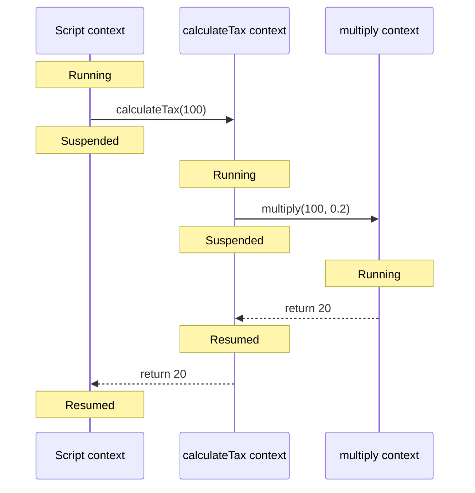

# Chapter 2 — Execution Contexts

## Learning objectives

After completing this chapter, you should be able to:

- define an execution context without treating it as a JavaScript object;
- trace how function calls switch the running execution context;
- distinguish execution contexts, lexical environments, and engine stack frames;
- explain declaration instantiation without relying on the informal “creation phase” myth;
- reason about suspended async functions and generators;
- connect fresh function invocations to React render behavior.

## Why This Matters

Execution contexts sit underneath function calls, `this`, scope resolution, closures, generators, and async functions. Interviewers rarely need a recitation of specification fields. They want to know whether you can trace which code is running, which invocation owns its local state, and what is suspended or resumed when control moves.

An inaccurate context model causes practical mistakes. It can make a developer assume that a closure retains an entire call stack, that `await` leaves a normal stack frame blocked, or that React reuses a component's local variables across renders.

## Core Mental Model

An execution context is the specification's **control record for one active or suspended evaluation**. It answers questions such as:

- What code is being evaluated?
- Which function, script, module, and realm does that code belong to?
- Where should evaluation continue if it is suspended and later resumed?
- Which environment components are relevant to the current evaluation?

At most one execution context per agent is running at a time. It is normally the top entry of the agent's execution-context stack. A function call can push a new context; completion normally removes it and resumes the caller.

Keep three models separate:

| Concept | What it models | Important qualification |
| --- | --- | --- |
| Execution context | Runtime evaluation state and transfer of control | Purely a specification mechanism |
| Lexical environment and environment records | Identifier bindings and outer-environment relationships | Scope follows lexical nesting, not the dynamic caller |
| Engine stack frame | An implementation's storage and bookkeeping for a call | May be optimized, inlined, or represented differently |

These models are related, but they are not interchangeable.

## Formal Model

### Running context and context stack

ECMA-262 defines an execution context as a device for tracking runtime evaluation. Each agent has an execution-context stack, and the **running execution context** is its top element. When control transfers to code not associated with the current context, a new context is created, pushed, and made current.

The transition is usually last-in, first-out, but “usually” matters. Generators and async evaluation can suspend and later resume contexts. The specification models the required behavior without requiring an engine to preserve a literal native stack frame for the entire suspension.

### Required state

Every execution context contains at least:

- **code evaluation state:** enough state to perform, suspend, and resume its evaluation;
- **Function:** the function object being evaluated, or `null` for script or module code;
- **Realm:** the realm whose ECMAScript resources are used;
- **ScriptOrModule:** the originating script or module record, when one exists.

Algorithms evaluating ECMAScript code also work with `LexicalEnvironment`, `VariableEnvironment`, and `PrivateEnvironment` components of the running context. Those components lead to the environment records covered in Chapter 4.

An execution context cannot be read or modified from JavaScript. Diagrams that display it as an object are teaching notation, not runnable object structure.

### Calling an ordinary function

For an ordinary ECMAScript function call, the specification's work can be summarized as follows:

1. Evaluate the callee and argument expressions in the caller.
2. Prepare a new function execution context associated with the callee's realm and function object.
3. Suspend the caller and push the callee context.
4. Establish the function environment, including parameters and the appropriate `this` binding.
5. Instantiate declarations needed by the function body.
6. Evaluate the body and produce a completion record.
7. Remove the callee context and restore the caller as the running context.

Abrupt completion—such as `throw`—changes how the result propagates, but it does not mean the callee simply disappears without cleanup. The specification routes normal and abrupt completion explicitly.

### Declaration instantiation is not a universal “creation phase”

Many interview explanations claim that every execution context has two formal phases: a creation phase and an execution phase. ECMA-262 instead defines concrete declaration-instantiation algorithms for scripts, modules, functions, blocks, and other constructs.

For a function call, parameter bindings, function declarations, `var` bindings, and lexical declarations are established according to `FunctionDeclarationInstantiation` before the body statements are evaluated. Their initialization rules differ:

- function declarations are generally initialized with function objects;
- `var` bindings are initialized to `undefined`;
- `let`, `const`, and `class` bindings exist but remain uninitialized until evaluation reaches their declarations.

“Creation phase” can be shorthand for teaching, but it should not be presented as a single named ECMAScript phase with one universal algorithm.

## Step-by-Step Runtime Walkthrough

Predict the output and the sequence of running contexts:

```js
const taxRate = 0.2;

function calculateTax(amount) {
  return multiply(amount, taxRate);
}

function multiply(left, right) {
  return left * right;
}

console.log(calculateTax(100));
```

The output is:

```text
20
```

The control flow is:

1. The script is being evaluated in a script-associated execution context.
2. `calculateTax(100)` prepares and pushes a context for that function invocation. It becomes the running context.
3. `calculateTax` resolves `multiply` and `taxRate` through lexical environments. Those names are global because the function was defined in global lexical scope—not because the script context is its caller.
4. `multiply(amount, taxRate)` evaluates its arguments, then pushes a new context for `multiply`.
5. `multiply` returns `20`. Its context is removed, and the suspended `calculateTax` context resumes.
6. `calculateTax` returns `20`. Its context is removed, and the script context resumes.
7. `console.log` is invoked with `20`.

Calling one function from another changes the execution-context stack. It does not change the called function's lexical parent.

## Visual Model



This represents specification-level control transfer. It does not guarantee three physical engine frames; an optimizing engine could inline one or both function calls while preserving observable behavior.

## Progressive Examples

### Foundational: each invocation has distinct local state

```js
function formatRequest(requestId) {
  const prefix = 'request';
  return `${prefix}:${requestId}`;
}

console.log(formatRequest(17));
console.log(formatRequest(42));
```

Each call creates a new function execution context and function environment. The two `requestId` bindings are distinct even though they come from the same function definition.

Expected output:

```text
request:17
request:42
```

### Production-oriented: an async function does not block a stack frame

Run this in a modern browser or Node.js:

```js
async function loadProfile() {
  console.log('load: start');
  await null;
  console.log('load: resumed');
}

console.log('script: start');
loadProfile();
console.log('script: end');
```

Predict the output:

```text
script: start
load: start
script: end
load: resumed
```

Calling `loadProfile` begins synchronously and creates its function execution context. Evaluation reaches `await`, suspends the async evaluation, and the call returns a promise. The caller continues; a normal synchronous stack frame is not left blocking the thread. Later, promise-job machinery resumes the async evaluation and `load: resumed` executes.

Engines may expose an async stack trace that links the continuation to `loadProfile`. That diagnostic chain is not evidence that one uninterrupted physical stack frame remained active across the wait.

### Interview-level edge case: lexical parent is not dynamic caller

Predict the result:

```js
const label = 'global';

function readLabel() {
  return label;
}

function invokeReader() {
  const label = 'local';
  return readLabel();
}

console.log(invokeReader());
```

The output is:

```text
global
```

At runtime, the contexts are script → `invokeReader` → `readLabel`. But `readLabel` was created in global lexical scope, so its identifier lookup does not search `invokeReader`'s local bindings. Dynamic call order and lexical scope answer different questions.

## Common Misconceptions

### “An execution context is an object containing all local variables”

It is an inaccessible specification mechanism. Bindings are modeled by environment records associated with the evaluation. A debugger may present locals in an object-like panel, but that interface is not the ECMAScript model.

### “Execution context and scope are the same thing”

An execution context tracks an evaluation in progress. Scope and environment records determine where identifiers resolve. Multiple invocations of one function have separate contexts and local bindings while sharing the same lexical structure.

### “The call stack is exactly the execution-context stack”

The execution-context stack is normative specification machinery. An engine call stack is an implementation structure. They often correspond well enough for diagrams, but optimization, inlining, generators, async functions, and debugging metadata expose the limit of the equivalence.

### “Hoisting means declarations are moved to the top”

Source text is not rearranged. Declaration-instantiation algorithms create and initialize bindings at defined times before or during evaluation. Different declaration forms have different initialization behavior.

### “Returning always destroys the context and everything it created”

A normal completed context is removed from the context stack, but reachable values and environments can remain. A closure can retain an environment containing captured bindings. A suspended generator can retain state needed for resumption. Reachability, not stack membership alone, governs memory lifetime.

### “Every asynchronous callback resumes the context that scheduled it”

A later callback normally runs as a new function invocation with its own context. An async function continuation is modeled through suspension and resumption, but a timer callback is not the original scheduling call continuing its synchronous stack.

## React Connection

A function component is still a JavaScript function. Each time React calls it, that invocation gets a fresh execution context and fresh local bindings.

```jsx
function ProductSearch({ query }) {
  const normalizedQuery = query.trim().toLowerCase();

  function handleSearch() {
    console.log(normalizedQuery);
  }

  return <button onClick={handleSearch}>Search</button>;
}
```

On every render:

1. React invokes `ProductSearch`.
2. A new function execution context and function environment are established.
3. A new `normalizedQuery` binding is initialized for that render.
4. A new `handleSearch` function closes over that render's environment.
5. The component invocation completes, but the environment can remain reachable through the event handler.

This explains why local variables do not persist as mutable component storage and why handlers from earlier renders can observe earlier values. React state is stored by React outside the component invocation and supplied back as a snapshot during a later render.

React Strict Mode may call component functions more than once in development to expose impure rendering. Each call is a real JavaScript invocation; React is not “resetting one execution context.” Component rendering must therefore avoid mutating preexisting external values.

Execution contexts alone do not explain closure retention or React state snapshots. They provide the control-flow half of the model; Chapters 4, 6, and 59–60 add the environment and closure details.

## Performance and Memory Implications

Function calls have runtime cost, but the ECMAScript context model does not prescribe a particular allocation per call. Engines can inline functions, eliminate frames, reuse storage, or materialize information only when debugging or deoptimization requires it. Do not estimate performance by counting conceptual context boxes.

Recursion and deeply nested synchronous calls can exhaust an implementation's stack, but ECMAScript does not specify one universal maximum depth. Chapter 22 covers recursion and stack limits.

For memory reasoning, distinguish active execution from retained environments:

- a completed call no longer needs to be the running context;
- a returned closure may keep selected environment bindings reachable;
- a suspended generator or async evaluation can retain state needed to resume;
- a debugger can keep otherwise collectible values alive while paused.

Profile actual allocation and retaining paths before concluding that “execution contexts are leaking.”

## Debugging Techniques

### Read a synchronous stack trace

```js
function validateOrder(order) {
  assertPositive(order.total);
}

function assertPositive(value) {
  if (value <= 0) {
    throw new RangeError('Order total must be positive');
  }
}

validateOrder({ total: 0 });
```

The debugger will normally show frames for `assertPositive`, `validateOrder`, and the script. Use the trace to reconstruct dynamic calls. Do not use it to infer lexical scope: the caller shown below a frame is not necessarily its outer lexical environment.

### Inspect invocation-specific bindings

Set a breakpoint inside a function and inspect the **Call Stack** and **Scope** panes separately. Invoke the function with different arguments and observe that each paused invocation has its own parameter bindings. With recursion, selecting another frame changes which invocation's locals the debugger displays.

### Treat optimized and async stacks as diagnostics

Production engines may inline calls or omit information. Developer tools can reconstruct frames or preserve async causality to make debugging useful. A displayed stack is evidence about the execution path, not a direct dump of the specification's execution-context stack.

## Interview Questions

### Level 1 — Fundamentals

**Question:** What is an execution context?

**Model answer:**

An execution context is ECMAScript's specification mechanism for tracking the evaluation of code. It carries state such as the current function, realm, originating script or module, and enough evaluation state to run, suspend, or resume. Each agent has a context stack, and the running context is normally the top entry. Calling a function usually pushes a new context and returning removes it. I would not describe it as a JavaScript object or assume it maps exactly to an engine stack frame.

### Level 2 — Applied understanding

**Question:** Does each call to the same function receive a new execution context?

**Model answer:**

Yes, each active invocation is a separate evaluation and normally gets its own function execution context and function environment. That is why recursive calls and two calls with different arguments have independent local bindings. The function object can be the same in every call, while the invocation state is different. An optimizing engine may inline or optimize away physical frames, but it must preserve the same observable semantics.

### Level 3 — Senior reasoning

**Question:** What happens to an async function's execution context at `await`?

**Model answer:**

The async function starts synchronously in its own function execution context. If `await` cannot continue immediately under the async-function algorithms, evaluation is suspended and the function call returns a promise to its caller. The caller can continue; the thread is not blocked by a normal stack frame. Promise-job machinery later resumes the async evaluation with either a fulfillment value or a rejection. DevTools may connect both sides with an async stack trace, but that does not imply one physical stack remained active during the wait.

### Level 4 — Deep follow-up

**Question:** When a closure outlives a function call, does it preserve the function's execution context?

**Model answer:**

The precise model is that the closure's function object retains a reference to the lexical environment in which it was created. That environment can keep captured bindings reachable after the outer invocation finishes. The completed outer execution context does not need to remain on the execution-context stack, and an engine does not have to preserve its entire physical frame. This distinction matters in memory debugging because I would inspect retaining paths to specific environments and values rather than assume every local from the call is retained.

## Exercises

### 1. Trace running contexts

For the following code, list the running context after each function call and return:

```js
function first(value) {
  return second(value + 1);
}

function second(value) {
  return value * 2;
}

console.log(first(5));
```

<details>
<summary>Solution</summary>

The script context runs first. Calling `first` suspends it and makes the `first` context current. Calling `second` suspends `first` and makes the `second` context current. `second` returns `12`, so `first` resumes. `first` returns `12`, so the script resumes and calls `console.log`.

</details>

### 2. Predict async output

```js
async function run() {
  console.log('B');
  await Promise.resolve();
  console.log('D');
}

console.log('A');
run();
console.log('C');
```

<details>
<summary>Solution</summary>

```text
A
B
C
D
```

`run` begins synchronously. Its evaluation suspends at `await`, so the script continues and logs `C`. The async continuation later resumes through promise-job scheduling and logs `D`.

</details>

### 3. Correct the model

Correct this explanation:

> Calling a function creates a context object and moves all declarations to its top. When the function returns, the context object and every local value are immediately deleted.

<details>
<summary>Solution</summary>

An execution context is an inaccessible specification mechanism, not a JavaScript object. Source declarations are not moved. Declaration-instantiation algorithms create and initialize bindings according to declaration type. A completed function context is normally removed from the context stack, but reachable objects and captured environments can remain; garbage collection depends on reachability.

</details>

### 4. Diagnose the React assumption

A developer writes a local variable in a component and expects it to remember the previous render's value:

```jsx
function Counter() {
  let previousCount = 0;
  const [count, setCount] = React.useState(0);

  previousCount = count;
  // ...
}
```

Why does this not provide persistent per-component storage?

<details>
<summary>Solution</summary>

Every component invocation creates fresh local bindings, so `previousCount` is initialized to `0` on every render before it is assigned. React state and refs persist because React stores their data outside a particular component invocation and associates it with the component instance's position in the tree. A ref is appropriate when mutable persistent data should not trigger rendering; state is appropriate when a change should affect rendered output.

</details>

### 5. Explain the distinction aloud

In 45 seconds, distinguish an execution context, a lexical environment, and an engine stack frame. Include one practical consequence of confusing them.

## Chapter Summary

- **Essential model:** an execution context tracks one active or suspended evaluation; the running context is normally the top of an agent's context stack.
- **Important distinctions:** invocation versus function definition, execution context versus lexical environment, and specification context versus physical engine frame.
- **Mistakes to avoid:** treating a context as a JavaScript object, describing hoisting as source movement, equating callers with lexical parents, or assuming `await` blocks a stack frame.
- **Practical consequence:** every React component render is a fresh function invocation with fresh locals, while closures can retain that render's environment.

### Interview-ready explanation

An execution context is ECMAScript's internal model for tracking code evaluation. A function call normally creates and pushes a new context containing the function, realm, source association, and evaluation state; the caller is suspended until the callee completes. Contexts are not JavaScript objects and do not map rigidly to engine frames. Bindings live in environment records, so lexical scope is separate from dynamic call order. That distinction explains why closures can retain bindings after a call finishes, why async functions can suspend without blocking a synchronous stack, and why each React render receives fresh local variables.

## Further Reading

- [ECMA-262: Execution Contexts](https://tc39.es/ecma262/#sec-execution-contexts)
- [ECMA-262: PrepareForOrdinaryCall](https://tc39.es/ecma262/#sec-prepareforordinarycall)
- [ECMA-262: FunctionDeclarationInstantiation](https://tc39.es/ecma262/#sec-functiondeclarationinstantiation)
- [ECMA-262: Async Functions](https://tc39.es/ecma262/#sec-async-function-definitions)
- [ECMA-262: Generator Objects](https://tc39.es/ecma262/#sec-generator-objects)
- [React: Keeping Components Pure](https://react.dev/learn/keeping-components-pure)
- [React: State as a Snapshot](https://react.dev/learn/state-as-a-snapshot)
