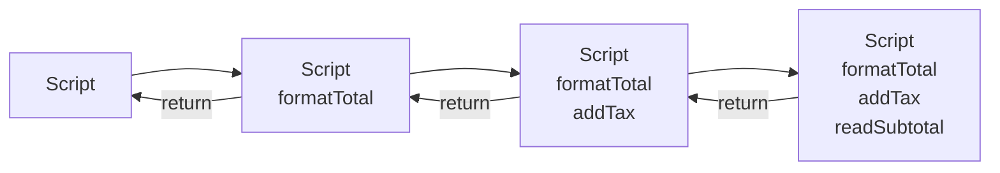

# Chapter 3 — The Call Stack

## Learning objectives

After completing this chapter, you should be able to:

- trace synchronous function calls in last-in, first-out order;
- distinguish the specification's execution-context stack from an engine call stack;
- explain how returns and thrown errors unwind calls;
- reason about recursion limits without inventing a universal maximum;
- explain why asynchronous callbacks do not continue the scheduling call's synchronous stack;
- use browser stack traces, source maps, and breakpoints effectively;
- connect blocking call chains and render errors to React applications.

## Quick Refresher

- The call stack represents unfinished synchronous function calls.
- Calls complete in last-in, first-out order: the most recent callee finishes before its caller.
- ECMAScript formally defines an execution-context stack; engine stack frames are implementation details.
- A thrown value propagates through active calls until a matching `catch` handles it.
- A later asynchronous callback does not retain the scheduling function's synchronous stack.
- Async stack traces show reconstructed causality, not continuously active frames.
- Stack depth does not measure execution time, and ECMAScript defines no universal recursion limit.
- JavaScript call stacks and React component stacks describe different structures.

## Why This Matters

Stack questions test more than whether you can draw boxes. A senior frontend engineer must reconstruct the path to a failure, distinguish synchronous callers from asynchronous origins, identify why a handler blocks rendering, and understand why an error is—or is not—caught.

The call stack is also where specification language and debugging language easily blur. ECMAScript specifies execution-context transitions. Engines expose implementation-level frames and formatted stack traces. The models correspond closely for ordinary synchronous calls, but they are not identical guarantees.

## Core Mental Model

For ordinary synchronous calls, model the call stack as a last-in, first-out record of unfinished calls:

1. Calling a function places its work above the caller.
2. The callee runs while the caller waits.
3. Returning removes the callee and resumes the caller.
4. Throwing propagates an abrupt completion outward until a matching handler is found.

The top frame is the code currently executing. Lower frames describe how control arrived there.

This is an intentionally practical model. Formally, ECMA-262 defines an execution-context stack. An engine can inline calls, optimize frames, or reconstruct debugging information while preserving observable behavior. Use “call stack” for runtime and debugger reasoning, but do not claim that ECMAScript mandates a particular native-memory layout.

## Formal Model

### Execution-context transitions

Each ECMAScript agent has an execution-context stack, and its running execution context is the top entry. An ordinary function call normally suspends the caller, creates and pushes a callee context, evaluates the body, removes the callee context, and restores the caller.

The familiar stack diagram is therefore grounded in the specification, even though an engine frame is implementation-specific.

### Completion records and unwinding

ECMAScript uses **Completion Records** to model the result of evaluating statements and operations. A completion has a type such as `normal`, `return`, `throw`, `break`, or `continue`. Any type other than `normal` is an **abrupt completion**.

For a function call:

- a `return` completion supplies the function's result;
- a `throw` completion propagates through callers unless code handles it;
- `try`, `catch`, and `finally` transform or propagate completions according to their algorithms.

“Stack unwinding” is useful runtime language for frames being exited while a thrown value searches outward for a handler. The more precise specification explanation is propagation of a throw completion through nested evaluations and calls.

JavaScript allows any value to be thrown, although throwing `Error` objects is normally better because they carry a message, error type, and implementation-provided diagnostic stack.

### Engine frames and stack traces

A physical or virtual **stack frame** is engine bookkeeping for a call. It can contain return information, arguments, locals, and optimization metadata, but ECMAScript does not specify its layout.

`error.stack` is not standardized by ECMA-262. Engines commonly provide it, but its format, frame limit, capture timing, and async information can differ. V8 documents its own behavior, including `Error.stackTraceLimit` and `Error.captureStackTrace`; those APIs must be labeled V8-specific.

### Async boundaries

A timer, event, or promise continuation executes after the scheduling code has finished. Its synchronous callback invocation starts from host or job-processing machinery rather than remaining above the original scheduling function on one uninterrupted stack.

Developer tools may append **async stack frames** or scheduling ancestry. That is valuable causal metadata: it answers “what scheduled this?” It should not be mistaken for the live synchronous frames present when the callback executes.

## Step-by-Step Runtime Walkthrough

Predict the logs and trace the stack:

```js
function readSubtotal(order) {
  console.log('readSubtotal');
  return order.subtotal;
}

function addTax(order) {
  console.log('addTax: start');
  const subtotal = readSubtotal(order);
  console.log('addTax: end');
  return subtotal * 1.2;
}

function formatTotal(order) {
  console.log('formatTotal: start');
  const total = addTax(order);
  console.log('formatTotal: end');
  return `$${total.toFixed(2)}`;
}

console.log(formatTotal({ subtotal: 100 }));
```

Expected output:

```text
formatTotal: start
addTax: start
readSubtotal
addTax: end
formatTotal: end
$120.00
```

The significant stack states are:

1. Script
2. Script → `formatTotal`
3. Script → `formatTotal` → `addTax`
4. Script → `formatTotal` → `addTax` → `readSubtotal`
5. `readSubtotal` returns: Script → `formatTotal` → `addTax`
6. `addTax` returns: Script → `formatTotal`
7. `formatTotal` returns: Script

The first call placed on the stack is the last of these application calls to finish. This explains both log order and the ordering of frames in a typical error trace: the most recent active call appears at the top, with earlier callers below it.

## Visual Model



Read each column from bottom to top: the topmost function is running. The diagram models dynamic calls, not lexical nesting.

## Progressive Examples

### Foundational: return unwinds one call at a time

```js
function double(value) {
  return value * 2;
}

function incrementAndDouble(value) {
  return double(value + 1);
}

console.log(incrementAndDouble(4)); // 10
```

`incrementAndDouble` remains unfinished while `double` runs. `double` returns `10`; then `incrementAndDouble` returns that same value. JavaScript does not skip the suspended caller simply because its final operation is another function call. An engine may optimize a tail-position call, but application reasoning must not depend on physical frame elimination.

### Production-oriented: error propagation through service layers

```js
function parsePrice(rawPrice) {
  const price = Number(rawPrice);

  if (!Number.isFinite(price)) {
    throw new TypeError('Price must be numeric');
  }

  return price;
}

function normalizeProduct(payload) {
  return {
    id: payload.id,
    price: parsePrice(payload.price),
  };
}

function handleProductResponse(payload) {
  try {
    return normalizeProduct(payload);
  } catch (error) {
    console.error('Invalid product response', error);
    return null;
  }
}

console.log(handleProductResponse({ id: 'p-1', price: 'unknown' }));
```

`parsePrice` throws. Its call does not return normally. The throw propagates through `normalizeProduct` until the `catch` inside `handleProductResponse` handles it. The catch logs the error and converts the operation into a normal return of `null`.

At the moment the error is created, a typical stack trace records `parsePrice`, `normalizeProduct`, `handleProductResponse`, and the top-level caller. After the catch runs, those inner calls are no longer active even if the `Error` object still contains its diagnostic stack string.

### Interview-level edge case: `try/catch` does not cross a later task

Predict whether the catch block runs in a browser or Node.js:

```js
try {
  setTimeout(() => {
    throw new Error('Timer failed');
  }, 0);
} catch (error) {
  console.log('caught', error.message);
}
```

The catch block does not run. `setTimeout` schedules a later callback and returns. The `try` statement completes before the timer callback receives its own invocation. When that callback throws, the original `try` frame is not on the synchronous stack.

Handle the error inside the callback, or represent the operation with a promise and handle its rejection at the appropriate boundary:

```js
function waitForFailure() {
  return new Promise((resolve, reject) => {
    setTimeout(() => reject(new Error('Timer failed')), 0);
  });
}

waitForFailure().catch(error => {
  console.log('caught', error.message);
});
```

This does not make the original synchronous `try/catch` persist. It establishes a promise rejection path for the later result.

## Common Misconceptions

### “The call stack stores every function that has run”

It represents unfinished synchronous calls, not execution history. Completed calls are removed. Profilers, traces, and logs record history using other mechanisms.

### “A stack trace is the call stack itself”

A stack trace is a diagnostic snapshot or formatted reconstruction. The `Error` can outlive the active calls it describes. Async frames and source maps can add reconstructed information.

### “The stack always matches source-level function calls”

Optimizing engines may inline functions or omit frames. Debuggers attempt to present useful source-level frames, but names and locations can be missing, transformed, or affected by build tooling.

### “Async code stays on the stack while it waits”

Waiting timers, network operations, and settled-later promises do not leave the scheduling function's synchronous frame active. Continuations run in later invocations. Async stack tooling preserves causality, not a blocked live stack.

### “Stack overflow has a standard recursion depth”

ECMAScript does not define one maximum. Limits depend on engine, platform, function shape, optimization state, and available resources. A depth observed in one benchmark is not portable.

### “Catching an error repairs the failed operation”

A catch prevents that throw completion from propagating further, but application state may already be partially changed. Senior-level error handling considers rollback, invariants, observability, and whether recovery is actually possible.

## React Connection

### Render work is a synchronous call chain

When React renders, it invokes component functions and other render-time functions as JavaScript. Expensive computation nested several calls deep still occupies the browser's main thread until control returns. A deep stack is not necessarily slow; total work in the chain is what matters. Conversely, one shallow frame can perform a long loop and block the UI.

Use a browser performance trace and React Profiler together: the browser trace shows main-thread occupation, while React Profiler attributes framework render and commit work to components.

### JavaScript stack versus component stack

A JavaScript stack trace describes function calls. A React **component stack** describes where a component appears in the rendered component tree. They answer different questions and need not have the same shape.

React error boundaries catch errors thrown while rendering descendant components and in certain React lifecycle paths. This does not work by leaving the parent component's JavaScript `try/catch` active:

```jsx
function Parent() {
  try {
    return <Child />;
  } catch (error) {
    return <p>Could not render child.</p>;
  }
}
```

Returning `<Child />` creates a React element; React invokes `Child` later as part of its own traversal. The `Parent` call has already returned, so this catch does not surround `Child`'s render call. Use an error boundary for render failures.

Error boundaries are not universal exception handlers. Errors in event handlers and unrelated asynchronous callbacks require handling in those execution paths.

## Performance and Memory Implications

### Depth is not duration

Stack depth measures nested unfinished calls. It does not measure CPU time. Investigate frame duration and aggregated self-time rather than treating a long trace as proof of poor performance.

### Recursion consumes bounded implementation resources

Unbounded recursion eventually produces an implementation-specific error such as `RangeError: Maximum call stack size exceeded` in V8-based environments. Iteration or an explicit work stack may be safer for input-dependent depth. Do not rely on proper tail-call optimization across deployed browsers.

### Capturing stacks has a cost

Creating errors, increasing stack-trace limits, and retaining stack metadata can add CPU and memory overhead. Exact costs are engine-specific. Capture diagnostic stacks where they improve observability, not as a substitute for ordinary control flow.

A stack frame disappearing does not imply all referenced values are collected. Closures, suspended computations, application objects, logs, and debugger state can retain values independently.

## Debugging Techniques

### Read from the failure outward

In a conventional stack trace, start at the top application frame: it identifies where the error surfaced. Then move downward to reconstruct callers. Ignore-listed framework and vendor frames can reduce noise, but inspect them when the boundary itself may be relevant.

### Pause on exceptions

In Chrome DevTools **Sources**, enable **Pause on uncaught exceptions**. If an error is caught too far from its cause, also enable pausing on caught exceptions temporarily. At the pause:

1. inspect the Call Stack pane;
2. select frames to examine invocation-specific locals;
3. distinguish the top failure frame from the lower entry-point frame;
4. verify whether the frame belongs to authored, framework, or generated code.

### Use source maps carefully

Production bundles transform names and locations. Source maps let tooling map generated frames back to original source. Verify that deployed source maps correspond to the exact build and that your error-reporting service applied them successfully. A symbolicated stack built with the wrong artifact can be confidently misleading.

### Understand non-standard stack APIs

`console.trace()` is useful for printing the current call path. `error.stack` is widely available but non-standard. `Error.captureStackTrace`, `Error.stackTraceLimit`, and `Error.prepareStackTrace` are documented V8 extensions; do not build cross-browser logic around their exact output.

### Separate synchronous and asynchronous ancestry

Chrome DevTools can display async frames for supported operations. Treat the synchronous section as currently active calls and the async section as scheduling ancestry. This distinction often explains why a nearby `try/catch` did not intercept a later failure.

## Interview Questions

### Level 1 — Fundamentals

**Question:** What is the JavaScript call stack?

**Model answer:**

The call stack is the practical model for unfinished synchronous function calls. When one function calls another, the callee is placed above the caller; it runs and then returns control in last-in, first-out order. ECMAScript formally specifies an execution-context stack, while engines implement physical or optimized frames. That qualification matters because stack traces and frames are implementation diagnostics rather than a standardized memory layout.

### Level 2 — Applied understanding

**Question:** How does a thrown error move through the call stack?

**Model answer:**

A throw creates an abrupt completion. If the current evaluation does not handle it, it propagates out through callers, unwinding their active calls until a matching catch handles it or it reaches the host as uncaught. A catch can convert that path into a normal result or throw another error. The stack trace usually records the calls active when the error was created, but `error.stack` itself is non-standard and engine-formatted.

### Level 3 — Senior reasoning

**Question:** Why can a `try/catch` around `setTimeout` not catch an error thrown by the timer callback?

**Model answer:**

The `try` only surrounds the synchronous scheduling call. `setTimeout` returns, that stack unwinds, and the catch is no longer active. The host invokes the callback in a later task with a new synchronous call chain. An error thrown there must be caught in that path or represented through a rejection or another error-reporting boundary. DevTools may display the scheduling origin as an async frame, but that does not restore the old catch scope.

### Level 4 — Deep follow-up

**Question:** Can you infer runtime cost or lexical scope from a stack trace?

**Model answer:**

Not reliably. A stack trace shows a dynamic call path, not how much time each frame consumed; I need a CPU profile or performance trace for cost. It also shows callers, not lexical outer environments, so it cannot establish scope resolution. Optimization, inlining, source transformation, and async reconstruction can affect displayed frames. I use a trace to locate and reproduce a path, then combine it with scope inspection, source maps, and profiling evidence.

## Exercises

### 1. Trace the stack

```js
function a(value) {
  return b(value) + 1;
}

function b(value) {
  return c(value * 2);
}

function c(value) {
  return value - 3;
}

console.log(a(5));
```

List the application frames at maximum depth and predict the output.

<details>
<summary>Solution</summary>

At maximum application depth the order from bottom to top is script → `a` → `b` → `c`. `c(10)` returns `7`, `b` returns `7`, and `a` adds `1`, so the output is `8`.

</details>

### 2. Predict `finally` behavior

```js
function getStatus() {
  try {
    throw new Error('failed');
  } catch {
    return 'recovered';
  } finally {
    console.log('cleanup');
  }
}

console.log(getStatus());
```

<details>
<summary>Solution</summary>

```text
cleanup
recovered
```

The catch produces a return completion, but the `finally` block runs before the function finishes. Because the `finally` block completes normally, the earlier return completion continues. If `finally` itself returned or threw, its abrupt completion would replace the pending return.

</details>

### 3. Diagnose the missing catch

```js
function startImport() {
  try {
    Promise.reject(new Error('Import failed'));
  } catch (error) {
    console.log('caught', error.message);
  }
}

startImport();
```

Why does the catch not run, and how should the rejection be handled?

<details>
<summary>Solution</summary>

Creating a rejected promise does not synchronously throw that rejection from `Promise.reject`. The function returns with an unhandled rejected promise. Return or await the promise and handle it with `.catch`, or use `try/catch` around an `await` inside an async function.

</details>

### 4. Explain the React boundary

Why does `try { return <Child /> } catch { ... }` in a parent component not catch an error thrown when React later renders `Child`?

<details>
<summary>Solution</summary>

The parent creates and returns a React element description; it does not synchronously call `Child` inside that `try`. React invokes `Child` later in its own render traversal, after the parent's function call has returned. A React error boundary handles descendant render errors according to the component tree. Event-handler and unrelated async errors still need their own handling.

</details>

### 5. Debugging exercise

Capture a stack with `console.trace()` inside three nested functions. Then schedule the innermost function with `setTimeout` and compare the synchronous frames with the async ancestry shown by DevTools. Explain which frames are live and which are reconstructed.

## Chapter Summary

- **Essential model:** unfinished synchronous calls follow last-in, first-out control flow.
- **Important distinctions:** execution-context stack versus engine frames, active stack versus recorded trace, and synchronous callers versus async scheduling ancestry.
- **Mistakes to avoid:** treating stack depth as duration, expecting `try/catch` to cross async boundaries, assuming a universal recursion limit, or parsing `error.stack` as a standardized format.
- **React consequence:** JavaScript stacks and React component stacks describe different structures; render errors require React boundaries, while event and async errors require handling in their own paths.

### Interview-ready explanation

The call stack is the practical last-in, first-out model for unfinished synchronous calls. A callee runs above a suspended caller, and returns remove calls in reverse order. Throws propagate as abrupt completions until a catch handles them. ECMAScript formally defines an execution-context stack, while engines implement and optimize physical frames, so stack traces are diagnostic representations rather than standardized memory layouts. Async callbacks run on later synchronous stacks; DevTools may link their scheduling ancestry, but the original callers and catch blocks are no longer active.

## Further Reading

- [ECMA-262: Completion Record Specification Type](https://tc39.es/ecma262/#sec-completion-record-specification-type)
- [ECMA-262: Execution Contexts](https://tc39.es/ecma262/#sec-execution-contexts)
- [ECMA-262: The `throw` Statement](https://tc39.es/ecma262/#sec-throw-statement)
- [ECMA-262: The `try` Statement](https://tc39.es/ecma262/#sec-try-statement)
- [V8: Stack Trace API](https://v8.dev/docs/stack-trace-api)
- [Chrome DevTools: JavaScript Debugging Reference](https://developer.chrome.com/docs/devtools/javascript/reference)
- [React: Error Boundaries lint](https://react.dev/reference/eslint-plugin-react-hooks/lints/error-boundaries)
- [React: Component error boundary APIs](https://react.dev/reference/react/Component#catching-rendering-errors-with-an-error-boundary)
