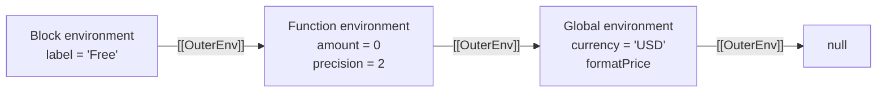

# Chapter 4 — Lexical Environments and Environment Records

## Learning objectives

After completing this chapter, you should be able to:

- explain bindings without treating scopes as ordinary JavaScript objects;
- describe how environment records and `[[OuterEnv]]` links model lexical nesting;
- distinguish declarative, function, module, object, and global environment records;
- explain binding creation, initialization, mutation, and deletion;
- reason about the temporal dead zone as an uninitialized-binding state;
- connect fresh render environments and retained bindings to React behavior.

## Quick Refresher

- Environment records are specification mechanisms that associate identifier names with bindings.
- A binding has lifecycle rules; it is not necessarily a property on an object.
- Each environment record has an `[[OuterEnv]]` link to its lexically enclosing record or `null`.
- Declarative records back language declarations; function and module records add specialized behavior.
- Object environment records expose object properties as bindings in specific language mechanisms.
- A global environment record combines declarative and object-backed behavior.
- `let`, `const`, and `class` bindings can exist while uninitialized; access then throws instead of searching outward.
- Closures retain reachable environments or bindings, not an entire active call stack.

## Why This Matters

“JavaScript looks for variables in outer scopes” is useful but incomplete. Senior interviews probe what a scope contains, why shadowing can throw before a declaration, why top-level `let` differs from top-level `var`, how module imports stay live, and what a closure actually retains.

Environment records provide one model for all of these behaviors. They also prevent misleading explanations such as “local variables are properties on the execution context” or “the temporal dead zone means the variable does not exist yet.”

## Core Mental Model

Think of an environment record as a specification-level **binding table with an outer link**:

- the table answers whether this environment contains a name and how its binding behaves;
- `[[OuterEnv]]` points to the lexically enclosing environment;
- different record types implement different binding rules.

Do not take “table” literally. Environment records are not ECMAScript objects, and engines do not have to allocate one dictionary for every source-level scope. The model describes observable name-binding semantics.

A binding is more than a name/value pair. Depending on its origin, it may be mutable or immutable, initialized or uninitialized, deletable or non-deletable, direct or an indirect live import binding.

## Formal Model

### Environment records

ECMA-262 defines Environment Record as a specification type used to associate identifiers with variables and functions according to lexical nesting. JavaScript code cannot directly access an environment record.

Environment records expose abstract operations such as:

- `HasBinding(name)`;
- `CreateMutableBinding(name, deletable)`;
- `CreateImmutableBinding(name, strict)`;
- `InitializeBinding(name, value)`;
- `SetMutableBinding(name, value, strict)`;
- `GetBindingValue(name, strict)`;
- `DeleteBinding(name)`.

These operations make binding lifecycle explicit. Creation and initialization are separate. A newly created lexical binding can therefore exist but remain uninitialized.

### Outer environment links

Every environment record has an `[[OuterEnv]]` field containing another environment record or `null`. When code evaluates a nested lexical construct, the new record normally points to the record for the surrounding lexical structure.

One outer environment can be shared by many inner environments. For example, separate calls to two nested functions can create different function environments whose outer links refer to the same retained outer environment.

Chapter 5 follows the complete identifier-resolution algorithm. For now, the essential rule is that failure to find a binding in one record leads resolution to its `[[OuterEnv]]`; finding an uninitialized binding is different and produces an error when its value is requested.

### Record types

| Environment record | Primary role | Important behavior |
| --- | --- | --- |
| Declarative | Bindings created directly by declarations | Supports mutable and immutable bindings without using object properties |
| Function | One ordinary function invocation | Adds `this`, `super`, `new.target`, and function-specific state where applicable |
| Module | Top-level module bindings | Represents imports as indirect live bindings and operates under strict-mode rules |
| Object | Object properties exposed as bindings | Used by mechanisms such as `with`; also participates in global environments |
| Global | Top-level script and host global bindings | Combines an object record with a declarative record |

Function and module environment records are specialized declarative records. A global environment is more complex than “the global object.”

### Function environments

Calling an ECMAScript function establishes a function environment for that invocation. It contains parameter and local bindings according to the function-declaration-instantiation algorithms and can provide `this`, `super`, and `new.target` semantics.

Edge cases such as default parameter initializers, direct `eval`, and non-simple parameter lists can require additional environments. Therefore, “one function call always equals exactly one environment record” is a useful diagram simplification, not a universal specification rule.

### Block environments and initialization

Evaluating a block containing lexical declarations creates a new declarative environment. `BlockDeclarationInstantiation` creates bindings for its `let`, `const`, `class`, and block-level function declarations before the block's statements execute.

For `let`, `const`, and `class`, the binding initially exists but is uninitialized. Access before initialization throws a `ReferenceError`. This interval is commonly called the **temporal dead zone**. It is not a separate storage area and does not mean resolution should continue to an outer binding with the same name.

### Global environments

A global environment record contains:

- an **object record** associated with the global object, used for built-ins and eligible top-level `var` and function declarations in script code;
- a **declarative record** used for top-level lexical declarations such as `let`, `const`, and `class`.

This is why a top-level lexical binding can be globally scoped without being a property of `globalThis`. Modules use module environment records instead and do not turn top-level declarations into global-object properties.

### Module environments and live imports

A module environment contains module-local bindings and import bindings. An import binding gives indirect access to a binding exported by another module. It is **live**: when the exporter updates a mutable exported binding, importers observe its current value. The importer cannot reassign the import binding itself.

Detailed module linking and evaluation belong to Chapters 35–38.

### Private environments

ECMAScript models class private names with PrivateEnvironment Records, which are similar to but distinct from ordinary Environment Records. They form their own outer-private-environment chain. Private names such as `#balance` are not string-keyed lexical bindings and are not object properties accessible through `['#balance']`.

## Step-by-Step Runtime Walkthrough

Predict the output:

```js
const currency = 'USD';

function formatPrice(amount) {
  const precision = 2;

  if (amount === 0) {
    const label = 'Free';
    return label;
  }

  return `${currency} ${amount.toFixed(precision)}`;
}

console.log(formatPrice(12));
console.log(formatPrice(0));
```

Expected output:

```text
USD 12.00
Free
```

The relevant environment behavior is:

1. Script evaluation establishes the global lexical binding `currency`.
2. Calling `formatPrice(12)` creates invocation-specific function bindings for `amount` and `precision`. Its outer environment is the environment captured when `formatPrice` was created—the global environment in this example.
3. The condition is false, so no `label` value is initialized for this path.
4. `currency` is not present in the function's local environment, so lookup can continue through its outer link to the global environment.
5. Calling `formatPrice(0)` creates a different function environment with new `amount` and `precision` bindings.
6. Entering the `if` block establishes a nested declarative environment. Its `label` binding is created and then initialized to `'Free'` when the declaration is evaluated.
7. Returning exits the block and function evaluations. Their active contexts finish, although an environment could outlive a call if reachable through a closure.

## Visual Model

For the `amount === 0` path:



The arrows show lexical nesting, not the dynamic call stack and not object prototype links.

## Progressive Examples

### Foundational: block bindings are distinct

```js
const status = 'outer';

{
  const status = 'inner';
  console.log(status);
}

console.log(status);
```

Expected output:

```text
inner
outer
```

The block environment has its own `status` binding and an outer link to the surrounding environment. Leaving the block restores the surrounding lexical environment for subsequent evaluation.

### Production-oriented: per-iteration bindings

```js
const handlers = [];

for (let index = 0; index < 3; index += 1) {
  handlers.push(() => index);
}

console.log(handlers.map(handler => handler()));
```

Expected output:

```text
[0, 1, 2]
```

For a `for` loop with a lexical declaration, ECMAScript creates per-iteration bindings. Each function captures the binding for its own iteration. Replacing `let` with `var` changes the binding model: the callbacks share one function- or global-scoped binding and typically produce `[3, 3, 3]`.

This behavior is not caused by `let` copying a primitive into each callback. Each closure refers to a distinct binding.

### Interview-level edge case: shadowing starts before initialization

Predict the result:

```js
const message = 'outside';

{
  console.log(message);
  const message = 'inside';
}
```

The first `console.log` throws a `ReferenceError`. Before block statements execute, the block environment already contains its own uninitialized `message` binding. Resolution finds that binding and does not fall back to the outer `message`. Reading its value before initialization triggers the temporal dead zone error.

## Common Misconceptions

### “A lexical environment is a normal object”

Environment records are specification types. Object-like diagrams explain associations but do not expose a runtime object available to application code.

### “Every variable is a property of some scope object”

Declarative bindings are not specified as object properties. Object environment records are a specialized case, and even the global environment combines object-backed and declarative bindings.

### “The temporal dead zone means the variable does not exist”

The binding exists but is uninitialized. This is why it shadows an outer binding and throws when accessed instead of allowing lookup to continue.

### “`const` makes a value immutable”

`const` creates an immutable binding: the binding cannot be reassigned after initialization. If it contains an object, the object's own mutable properties can still change.

### “A closure copies outer values”

A function retains access to its creation environment. It can observe later changes to a captured mutable binding. Engines may optimize representation, but value copying is not the general semantic model.

### “Top-level means property of `window`”

Top-level `let`, `const`, and `class` in a classic browser script use the declarative part of the global environment and do not become `window` properties. Module top-level bindings are module-scoped.

## React Connection

Every function-component invocation establishes fresh function-local bindings:

```jsx
function SearchResults({ query, items }) {
  const normalizedQuery = query.trim().toLowerCase();
  const visibleItems = items.filter(item =>
    item.name.toLowerCase().includes(normalizedQuery),
  );

  function handleReport() {
    console.log(normalizedQuery, visibleItems.length);
  }

  return <button onClick={handleReport}>Report visible results</button>;
}
```

Each render creates new `normalizedQuery`, `visibleItems`, and `handleReport` bindings. The handler retains access to the environment of the render in which it was created. This is the language foundation for React's “state as a snapshot” explanation and for stale-closure bugs.

Do not store persistent component state in ordinary local bindings: a later render is a new invocation with new bindings. React state and refs persist because React stores their associated data outside a particular function invocation.

The environment model also clarifies dependency arrays. An effect callback created during one render refers to bindings from that render; React cannot change which lexical environment an already-created function captured.

## Performance and Memory Implications

ECMAScript specifies binding behavior, not one allocation strategy. Engines can keep uncaptured locals in registers or stack storage, optimize environments away, or materialize them when debugging and deoptimization require it. Counting source scopes does not predict heap allocation.

When a closure remains reachable, its creation environment—or an optimized representation of the required bindings—can remain reachable too. Capturing one binding does not normatively require retaining every local variable, but real retention must be measured rather than inferred from source alone.

Practical memory investigations should identify:

- which function or listener remains reachable;
- which environment or context appears in the retaining path;
- which captured value dominates retained memory;
- whether removing a subscription or reference releases the path.

The presence of a closure is not itself a leak. A leak is unwanted retention relative to the application's intended lifetime.

## Debugging Techniques

### Inspect scope separately from calls

Pause inside a nested function in Chrome DevTools. The **Call Stack** pane shows dynamic callers; the **Scope** pane groups visible bindings into categories such as Local, Block, Closure, Script, and Global. Those labels are debugger presentation, not names of a universal engine object layout.

Select different call frames and observe that each invocation has different local bindings while closure and global bindings can be shared.

### Diagnose temporal dead zone errors

When “Cannot access before initialization” appears:

1. find the nearest lexical declaration with the same name;
2. identify the block, function, or module environment that owns it;
3. check whether evaluation reads the binding before its declaration initializes it;
4. include circular module evaluation as a possibility for imported or exported bindings.

Do not “fix” every case by changing `let` to `var`; that changes binding semantics and can conceal an ordering defect.

### Inspect closure retention

Use a heap snapshot and follow retaining paths from an unexpectedly retained object. DevTools may label a retaining node as a closure, context, or environment. Verify the actual application reference—often an event listener, subscription, timer, or cache—that keeps the function reachable.

## Interview Questions

### Level 1 — Fundamentals

**Question:** What is a lexical environment?

**Model answer:**

In current specification terms, identifier bindings are represented by Environment Records linked through `[[OuterEnv]]`. “Lexical environment” commonly refers to the current record and that outer chain for a piece of code. A record knows which names it binds and how those bindings are created, initialized, read, or changed. It is a specification mechanism, not a JavaScript object. The chain follows lexical nesting, which is why a function resolves names according to where it was created rather than who called it.

### Level 2 — Applied understanding

**Question:** Why does accessing a shadowed `let` before its declaration throw instead of reading the outer variable?

**Model answer:**

Before the block's statements run, block declaration instantiation creates the inner `let` binding, but it remains uninitialized until evaluation reaches the declaration. Identifier resolution therefore finds the inner binding and stops; it does not continue to the outer environment. Reading the uninitialized binding throws a `ReferenceError`. That interval is the temporal dead zone, and it is more precise to describe it as binding state than as a place in source code.

### Level 3 — Senior reasoning

**Question:** Why can three callbacks created in a `for (let ...)` loop observe three different indices?

**Model answer:**

The loop semantics create a distinct per-iteration binding for the lexical loop variable. Each callback is created with access to the environment for that iteration, so the callbacks refer to different `index` bindings. With `var`, the callbacks normally share one function- or global-scoped binding and see its final value. I would describe this as binding identity, not as JavaScript copying the number into each closure.

### Level 4 — Deep follow-up

**Question:** Is a top-level binding always a property of `globalThis`?

**Model answer:**

No. In classic script code, eligible top-level `var` and function declarations use the object-record side of the global environment and often create global-object properties. Top-level `let`, `const`, and `class` use its declarative record and are not properties of `globalThis`. Modules have module environment records, so their top-level declarations are module-scoped. I would also qualify console experiments because developer consoles can use host-specific evaluation behavior.

## Exercises

### 1. Predict shadowing output

```js
const value = 1;

{
  const value = 2;
  {
    console.log(value);
  }
}

console.log(value);
```

<details>
<summary>Solution</summary>

The output is `2` and then `1`. The innermost block has no `value`, so lookup reaches the immediately enclosing block binding. After both blocks finish, the final log resolves the outer binding.

</details>

### 2. Explain the error

```js
let enabled = true;

function check() {
  console.log(enabled);
  let enabled = false;
}

check();
```

<details>
<summary>Solution</summary>

The function's lexical environment contains a local `enabled` binding before body evaluation reaches the declaration. That binding is uninitialized at the log, so reading it throws a `ReferenceError`. The outer `enabled` is shadowed and is not used.

</details>

### 3. Compare global bindings

In a normal browser classic script, predict:

```js
var legacyMode = true;
let modernMode = true;

console.log(globalThis.legacyMode);
console.log(globalThis.modernMode);
```

<details>
<summary>Solution</summary>

The expected output is `true` and `undefined`. The `var` binding uses the object-record side of the global environment, while the `let` binding uses its declarative record. This example is environment-sensitive: a module, Node.js module wrapper, or developer console does not necessarily behave like a browser classic script.

</details>

### 4. Diagnose a React callback

A callback created during an old render reads an old `query` value even after state changes. Why can React not update the callback's existing environment?

<details>
<summary>Solution</summary>

The callback is a function created during a particular component invocation and retains access to that render's environment. A later render creates new bindings and usually a new callback; it does not mutate which environment the old function captured. The application must arrange for the latest callback to be used, declare dependencies correctly, use a functional state update where appropriate, or deliberately read mutable current data through a ref.

</details>

### 5. Explain the model aloud

In 45 seconds, distinguish a binding, an environment record, an outer-environment link, and an ordinary object property.

## Chapter Summary

- **Essential model:** environment records associate names with bindings and link to lexically enclosing records through `[[OuterEnv]]`.
- **Important distinctions:** binding versus property, creation versus initialization, lexical environment versus execution context, and outer-environment link versus call stack.
- **Mistakes to avoid:** treating scopes as objects, claiming the temporal dead zone means absence, assuming `const` freezes objects, or saying closures copy values.
- **React consequence:** every render creates fresh bindings, and callbacks retain access to the environment of their creation render.

### Interview-ready explanation

JavaScript models lexical bindings with Environment Records. Each record knows which identifiers it binds and links to its lexically enclosing record through `[[OuterEnv]]`. Different record types support functions, modules, global code, and object-backed bindings. Creation and initialization are separate, which explains the temporal dead zone: an inner binding can already shadow an outer one while still being unreadable. These are specification mechanisms rather than ordinary objects, and engines may optimize their storage. In React, each component invocation establishes fresh bindings, while callbacks can keep a particular render's environment reachable.

## Further Reading

- [ECMA-262: Environment Records](https://tc39.es/ecma262/#sec-environment-records)
- [ECMA-262: Declarative Environment Records](https://tc39.es/ecma262/#sec-declarative-environment-records)
- [ECMA-262: Function Environment Records](https://tc39.es/ecma262/#sec-function-environment-records)
- [ECMA-262: Global Environment Records](https://tc39.es/ecma262/#sec-global-environment-records)
- [ECMA-262: Module Environment Records](https://tc39.es/ecma262/#sec-module-environment-records)
- [ECMA-262: BlockDeclarationInstantiation](https://tc39.es/ecma262/#sec-blockdeclarationinstantiation)
- [ECMA-262: PrivateEnvironment Records](https://tc39.es/ecma262/#sec-privateenvironment-records)
- [React: State as a Snapshot](https://react.dev/learn/state-as-a-snapshot)
- [Chrome DevTools: JavaScript Debugging Reference](https://developer.chrome.com/docs/devtools/javascript/reference)
