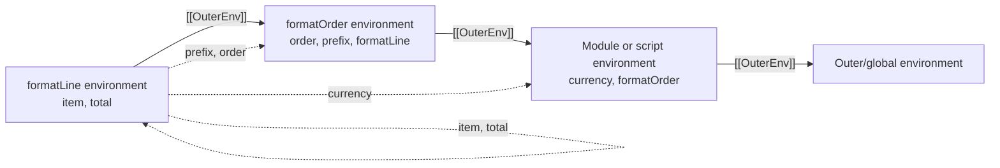

# Chapter 5 — Scope and Identifier Resolution

## Learning objectives

After completing this chapter, you should be able to:

- distinguish lexical scope from dynamic call order;
- trace identifier resolution through environment-record links;
- explain Reference Records without treating them as JavaScript values;
- distinguish identifier lookup from object property lookup;
- reason about shadowing, unresolvable references, and `typeof` edge cases;
- compare script, module, function, and block scope;
- diagnose scope-related bugs in React applications.

## Quick Refresher

- JavaScript uses lexical scope: where code is written determines its outer environments.
- Calling a function from another scope does not insert the caller's local bindings into the callee's lookup chain.
- `ResolveBinding` searches the current environment and follows `[[OuterEnv]]` links.
- Resolution produces an internal Reference Record; reading or assigning then uses that reference.
- Shadowing stops lookup at the nearest matching binding, even when that binding is still uninitialized.
- An unresolvable read normally throws `ReferenceError`; `typeof` has a special case for an unresolvable name.
- `obj.name` performs property access after resolving `obj`; it does not search lexical environments for `name`.
- Module scope prevents top-level declarations from becoming shared global bindings.

## Why This Matters

Scope questions reveal whether a candidate can predict behavior rather than repeat “inner scope can access outer scope.” Senior interviews add shadowing, callbacks, modules, globals, temporal dead zones, and property access. Production scope mistakes cause implicit globals, cross-component shared state, stale callbacks, and code that changes behavior when moved between scripts and modules.

The deeper skill is separating three structures: lexical environment chains, dynamic call stacks, and object prototype chains.

## Core Mental Model

When JavaScript evaluates an identifier such as `timeout`, it starts from the current lexical environment:

1. Ask the current environment whether it binds `timeout`.
2. If yes, stop with a reference to that binding.
3. If no, follow `[[OuterEnv]]` and repeat.
4. If the chain ends at `null`, produce an unresolvable reference.

The chain is determined by lexical nesting. It does not change because a function is called by code containing a same-named local variable.

Finding a binding and obtaining its value are separate steps. This is why resolution can find an uninitialized binding and then throw when code attempts to read it.

## Formal Model

### IdentifierReference evaluation

For an `IdentifierReference`, ECMAScript calls `ResolveBinding(name)`. Unless an environment is explicitly provided, `ResolveBinding` begins with the running execution context's current lexical environment and delegates to `GetIdentifierReference`.

`GetIdentifierReference` behaves recursively:

1. If the environment is `null`, return an unresolvable Reference Record.
2. Call `HasBinding(name)` on the current environment record.
3. If it returns `true`, return a Reference Record whose base is that environment.
4. Otherwise, continue with `[[OuterEnv]]`.

The result is a **Reference Record**, an internal specification type carrying information such as the base, referenced name, and strictness. It is not an object that JavaScript can store or inspect.

### Reading and writing through references

Evaluating `count` does not immediately produce the binding's value. It first produces a Reference Record. `GetValue` then reads through that reference. If the reference is unresolvable, `GetValue` throws a `ReferenceError`. If the environment binding exists but is uninitialized, its `GetBindingValue` operation also throws.

Assignment evaluates its left-hand side to a reference and applies `PutValue`. Assigning to an unresolvable reference in strict code throws. Legacy non-strict script semantics can create a property on the global object, which is one reason implicit assignment is dangerous. Modules are always strict, so the same mistake fails instead of silently creating shared global state.

### Lexical scope versus dynamic scope

JavaScript functions capture the environment in which they are created. Their outer lookup path does not become the environment of the caller.

```js
const mode = 'global';

function readMode() {
  return mode;
}

function callWithLocalMode() {
  const mode = 'local';
  return readMode();
}

console.log(callWithLocalMode()); // global
```

The dynamic call stack includes `callWithLocalMode` and then `readMode`. The lexical lookup chain for `readMode` starts from the environment captured where `readMode` was defined, so it reaches the global `mode` rather than the caller's local binding.

### Shadowing

An inner declaration **shadows** an outer declaration with the same name. Once `HasBinding` succeeds, resolution stops. It does not compare values or prefer an initialized outer binding.

This explains temporal-dead-zone shadowing:

```js
const status = 'ready';

{
  console.log(status); // ReferenceError
  const status = 'pending';
}
```

The block's `status` binding already exists but is uninitialized. Resolution finds it; reading it fails.

### Property references are different

In `settings.timeout`, `settings` is an identifier and is resolved lexically. `timeout` is a property key used with the resulting base value. JavaScript does not search outer lexical environments for a binding named `timeout`.

Similarly, destructuring can read a property and create a differently named binding:

```js
const { timeout: requestTimeout } = settings;
```

`timeout` is the property key; `requestTimeout` is the new lexical binding.

### Scope categories

- **Block scope:** `let`, `const`, `class`, and applicable block-level function declarations bind within a block environment.
- **Function scope:** parameters, `var`, and function-body declarations follow function-environment rules.
- **Script global scope:** top-level declarations use the global environment, with different handling for `var`/functions and lexical declarations.
- **Module scope:** top-level declarations belong to a module environment; module code is strict and imports are live indirect bindings.

“Global scope” is realm- and host-related, not one universal namespace shared by every tab, worker, iframe, and Node.js module.

### `with` and direct `eval`

Legacy `with` statements insert an Object Environment Record into the lookup chain, making identifier meaning depend on object properties at runtime. They are forbidden in strict mode and should not be used in modern code.

Direct `eval` can interact with the current environment under detailed strictness rules. It complicates static reasoning and engine optimization. This handbook treats it as a legacy boundary, not a normal metaprogramming tool.

## Step-by-Step Runtime Walkthrough

Predict the output:

```js
const currency = 'USD';

function formatOrder(order) {
  const prefix = 'Order';

  function formatLine(item) {
    const total = item.price * item.quantity;
    return `${prefix} ${order.id}: ${currency} ${total}`;
  }

  return order.items.map(formatLine);
}

console.log(
  formatOrder({
    id: 'A-17',
    items: [{ price: 5, quantity: 2 }],
  }),
);
```

Expected output:

```text
[ 'Order A-17: USD 10' ]
```

Inside `formatLine`, resolution proceeds by name:

1. `item` and `total` resolve in the current `formatLine` environment.
2. `prefix` is absent there, so resolution follows the outer link to the `formatOrder` environment.
3. `order` also resolves in the `formatOrder` invocation environment.
4. `currency` is absent from both function environments, so lookup reaches the module or script environment where the code was defined.
5. The fact that `Array.prototype.map` invokes `formatLine` does not make `map`'s internal call environment part of the function's lexical scope.
6. Property names such as `price`, `quantity`, `id`, and `items` are property lookups, not lexical identifier searches.

## Visual Model



The solid arrows are lexical outer links. They are not call-stack edges or prototype links.

## Progressive Examples

### Foundational: nearest binding wins

```js
const theme = 'system';

function renderPanel() {
  const theme = 'dark';

  if (true) {
    const theme = 'contrast';
    console.log(theme);
  }

  console.log(theme);
}

renderPanel();
console.log(theme);
```

Expected output:

```text
contrast
dark
system
```

Each use resolves to the nearest environment containing a `theme` binding.

### Production-oriented: module scope versus shared global state

```js
// request-id.js — ES module
let nextRequestId = 0;

export function createRequestId() {
  nextRequestId += 1;
  return `request-${nextRequestId}`;
}
```

`nextRequestId` is private to this module's environment unless exported. It is still shared by every importer instance of that evaluated module, so module scope prevents a global-name collision but does not provide per-component or per-request isolation.

For server rendering, a mutable module binding can unintentionally share state between requests handled by the same process. For React, it can share state across every mounted component using the module. Scope isolation and lifecycle isolation are different properties.

### Interview-level edge case: two meanings of `typeof`

Predict both results:

```js
console.log(typeof missingName);

{
  console.log(typeof pendingValue);
  let pendingValue = 1;
}
```

The first expression produces `'undefined'`: `typeof` has special behavior for an unresolvable reference. The second throws a `ReferenceError`: `pendingValue` resolves successfully to the block's uninitialized binding, so this is a temporal-dead-zone access rather than an unresolvable name.

## Common Misconceptions

### “JavaScript checks the caller's variables”

JavaScript is lexically scoped. A caller appears on the dynamic call stack but does not become the callee's outer environment.

### “If an inner binding has no value yet, lookup falls back outward”

Resolution is based on whether a binding exists. An uninitialized lexical binding exists and shadows outer names; reading it throws.

### “`obj.key` resolves `key` through scope”

Only `obj` is an IdentifierReference. `key` is a property name. Property lookup follows object semantics, including prototypes, rather than environment links.

### “`typeof` never throws for missing variables”

It avoids throwing for an unresolvable reference. It still throws when the name resolves to an uninitialized lexical binding.

### “Module scope means each importer gets a copy”

An evaluated module normally has one environment per module instance in its realm/module graph. Importers share its bindings and observe live exports.

### “No declaration means JavaScript creates a global variable”

That legacy behavior is limited to assignment through an unresolvable reference in non-strict code. Strict code and modules throw. Relying on implicit globals is erroneous and environment-sensitive.

## React Connection

React applications commonly use three lexical layers:

1. **Module scope:** imports, constants, helpers, caches, and any mutable module state shared by consumers.
2. **Component invocation scope:** props, state snapshots, derived values, and callbacks created for one render.
3. **Nested callback/block scope:** event parameters, effect-local variables, and temporary bindings.

```jsx
const defaultLimit = 20;

function Results({ limit = defaultLimit }) {
  const [page, setPage] = React.useState(1);

  function handleNextPage() {
    setPage((currentPage) => currentPage + 1);
  }

  return (
    <button onClick={handleNextPage}>
      Page {page}, limit {limit}
    </button>
  );
}
```

`defaultLimit` resolves from module scope. `limit`, `page`, and `handleNextPage` belong to the current component invocation. `currentPage` is a parameter binding created when React later invokes the updater.

The functional updater does not make `page` dynamically scoped. It avoids depending on the captured `page` binding by receiving the latest queued state as an argument.

Be cautious with mutable module bindings. They bypass React's state model, are shared across component instances, and do not trigger rendering when changed. Constants and stateless helpers are usually appropriate at module scope; user- or request-specific mutable data often is not.

## Performance and Memory Implications

The specification describes identifier resolution as walking environment links, but source nesting depth is not a reliable microbenchmark. Engines perform static scope analysis, allocate bindings efficiently, and can optimize repeated access. Do not flatten clean lexical structure to “speed up lookup” without measured evidence.

Features that make scope dynamic—particularly `with` and some forms of `eval`—restrict static reasoning and can inhibit optimization. Their maintainability and security costs are already sufficient reasons to avoid them.

Scope affects lifetime more than lookup performance in many frontend systems. A callback can retain bindings from an outer environment, and mutable module state can remain reachable for the lifetime of the module instance. Chapter 6 develops closure retention in detail.

## Debugging Techniques

### Separate Call Stack and Scope panes

At a breakpoint, the Call Stack pane shows how execution arrived at the current function. The Scope pane shows which bindings are visible from the selected frame. Use them together to avoid confusing a caller's locals with a function's lexical outer scope.

### Find shadowing deliberately

When a value is not the one expected:

1. locate every declaration with the same identifier;
2. identify the nearest lexical environment at the use site;
3. check parameter names, imports, catch parameters, and destructuring aliases;
4. inspect whether a binding is uninitialized rather than absent.

Static analysis rules such as `no-undef` and carefully configured `no-shadow` can catch mistakes, though intentional short local shadowing is not inherently wrong.

### Reproduce in the correct source type

Browser console snippets, classic scripts, ES modules, CommonJS modules, and bundler wrappers do not share identical top-level scope behavior. Reproduce a global-resolution bug in the same environment and build mode as production.

## Interview Questions

### Level 1 — Fundamentals

**Question:** How does JavaScript resolve an identifier?

**Model answer:**

JavaScript evaluates an identifier by calling the specification's binding-resolution machinery. It checks the current environment record for the name and follows `[[OuterEnv]]` links until it finds a binding or reaches the end. The result is an internal Reference Record, and reading through an unresolvable reference throws. The chain follows lexical nesting—where the function was created—not the runtime caller.

### Level 2 — Applied understanding

**Question:** What is shadowing, and why can it cause a temporal-dead-zone error?

**Model answer:**

Shadowing occurs when a nearer lexical environment contains the same name as an outer environment. Resolution stops at the nearer binding. A `let`, `const`, or `class` binding is created before its declaration executes but remains uninitialized, so it can already shadow the outer binding. Reading it during that interval throws instead of falling back outward.

### Level 3 — Senior reasoning

**Question:** Why is mutable module state risky in a React or server-rendered application?

**Model answer:**

Module scope prevents names from leaking into the global environment, but an evaluated module's bindings are shared by its consumers. A mutable module binding can therefore share data across component instances and, on a server, potentially across requests handled by the same module instance. Mutating it also bypasses React's update system. I use module scope for constants and deliberate shared services, and choose component state, context, request-local data, or an external store when lifecycle and subscriptions matter.

### Level 4 — Deep follow-up

**Question:** Why does `typeof missingName` return `'undefined'`, while `typeof value` can throw before `let value`?

**Model answer:**

`missingName` resolves to an unresolvable Reference Record, and `typeof` has a specific exception that returns `'undefined'` for that case. A lexical `value` binding in the temporal dead zone is different: resolution succeeds and returns a reference to the inner binding, but reading that uninitialized binding throws a `ReferenceError`. The distinction is unresolvable versus resolved-but-uninitialized.

## Exercises

### 1. Trace lexical lookup

```js
const value = 'module';

function outer() {
  const value = 'outer';

  return function inner() {
    return value;
  };
}

console.log(outer()());
```

<details>
<summary>Solution</summary>

The output is `outer`. `inner` has no local `value`, so lookup follows its outer link to the retained `outer` invocation environment. It finds that binding before reaching module scope.

</details>

### 2. Distinguish binding and property

```js
const timeout = 1000;
const options = { timeout: 5000 };

console.log(options.timeout);
console.log(timeout);
```

<details>
<summary>Solution</summary>

The output is `5000` and `1000`. The first expression resolves only `options` lexically, then reads its `timeout` property. The second resolves the lexical `timeout` binding. The same spelling does not connect the two lookup mechanisms.

</details>

### 3. Predict `typeof`

```js
console.log(typeof notDeclared);

try {
  console.log(typeof later);
  let later = 1;
} catch (error) {
  console.log(error.name);
}
```

<details>
<summary>Solution</summary>

The output is `undefined` followed by `ReferenceError`. `notDeclared` is unresolvable; `later` is resolved but uninitialized when read.

</details>

### 4. Diagnose implicit global behavior

Why can `result = 42` appear to work in a legacy classic script but fail in an ES module?

<details>
<summary>Solution</summary>

Without a declaration, the assignment produces an unresolvable reference. Legacy non-strict assignment can create a global-object property. Module code is always strict, and assigning through an unresolvable reference throws a `ReferenceError`. The fix is to declare the intended binding, not to depend on the legacy behavior.

</details>

### 5. React scope review

Classify each binding in the `Results` example as module-scoped, render-scoped, or callback-invocation-scoped, then explain which ones are shared across component instances.

## Chapter Summary

- **Essential model:** identifier resolution searches environment records along lexical `[[OuterEnv]]` links and produces an internal reference.
- **Important distinctions:** lexical chain versus call stack, binding versus property, unresolvable versus uninitialized, and module isolation versus lifecycle isolation.
- **Mistakes to avoid:** searching callers for variables, falling through a shadowing binding, assuming `typeof` never throws, or using mutable module state as implicit component state.
- **React consequence:** module bindings are shared, render bindings are recreated, and callback parameters belong to later invocations.

### Interview-ready explanation

JavaScript is lexically scoped. Resolving an identifier starts from the current environment record and follows `[[OuterEnv]]` links determined by where the code was defined. Resolution returns an internal Reference Record; reading an unresolvable reference normally throws, while a found but uninitialized binding throws because of temporal-dead-zone rules. Shadowing stops lookup at the nearest binding. Property access is separate: in `obj.key`, only `obj` is resolved lexically. In React, this distinction separates shared module bindings, per-render bindings, and parameters created when callbacks run later.

## Further Reading

- [ECMA-262: ResolveBinding](https://tc39.es/ecma262/#sec-resolvebinding)
- [ECMA-262: GetIdentifierReference](https://tc39.es/ecma262/#sec-getidentifierreference)
- [ECMA-262: Reference Record Specification Type](https://tc39.es/ecma262/#sec-reference-record-specification-type)
- [ECMA-262: GetValue](https://tc39.es/ecma262/#sec-getvalue)
- [ECMA-262: PutValue](https://tc39.es/ecma262/#sec-putvalue)
- [ECMA-262: Identifier Reference Evaluation](https://tc39.es/ecma262/#sec-identifiers-runtime-semantics-evaluation)
- [ECMA-262: Strict Mode](https://tc39.es/ecma262/#sec-strict-mode-of-ecmascript)
- [React: State as a Snapshot](https://react.dev/learn/state-as-a-snapshot)
- [Chrome DevTools: JavaScript Debugging Reference](https://developer.chrome.com/docs/devtools/javascript/reference)
