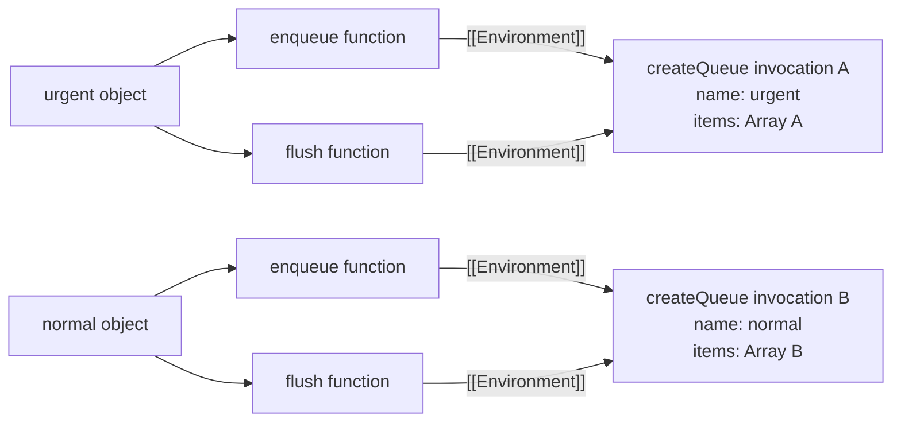

# Chapter 6 — Closures

## Learning objectives

After completing this chapter, you should be able to:

- define a closure using lexical environments rather than vague “remembering” language;
- explain why an outer function can return while captured bindings remain reachable;
- distinguish capturing a binding from copying its current value;
- predict shared and independent closure state;
- explain the difference between `var` and `let` in loop-created callbacks;
- identify closure-related memory retention and clean up long-lived callbacks;
- diagnose stale closures in React without treating every closure as a bug;
- choose between closures, objects, classes, and module state for encapsulation.

## Quick Refresher

- A closure is a function together with access to the lexical environment where that function was created.
- JavaScript functions close over bindings, not frozen copies of primitive values.
- An outer call may finish while its environment remains reachable through a returned callback.
- Closures created by the same outer invocation can share bindings; separate invocations normally create separate bindings.
- `let` in a `for` loop creates a fresh per-iteration binding when required by the loop semantics; `var` uses one function-scoped binding.
- A closure retains only what remains reachable through its environment graph; engines may optimize unobservable details.
- A retained callback can keep DOM nodes, caches, responses, or other large object graphs alive.
- In React, every render creates new bindings. A callback created during one render observes that render's state snapshot.
- A stale closure is usually a synchronization or lifecycle mistake, not evidence that closures themselves are unreliable.

## Why This Matters

Closures power callbacks, event handlers, promises, memoization, factory functions, module APIs, and nearly every React component. They are also a frequent source of weak interview answers. Saying “the inner function remembers the outer variables” predicts some behavior, but it does not explain mutation, shared state, loop bindings, stale React callbacks, or memory retention.

Senior engineers need a model that answers two production questions:

1. **Which binding will this callback read when it eventually runs?**
2. **What remains reachable for as long as this callback remains reachable?**

The first question is about correctness. The second is about lifetime and memory.

## Core Mental Model

When JavaScript creates an ordinary function, the function object receives an internal `[[Environment]]` slot referring to the lexical environment active at creation time. When the function is called later, the new function environment links outward to that saved environment.

```js
function createCounter() {
  let count = 0;

  return function increment() {
    count += 1;
    return count;
  };
}

const next = createCounter();

console.log(next()); // 1
console.log(next()); // 2
```

The `createCounter` execution context is removed from the call stack after it returns. That does not make its bindings unreachable. The returned `increment` function still refers to the environment containing `count`, so that environment remains available.

Three structures must remain separate:

- the **call stack** records currently active calls;
- the **lexical environment chain** determines identifier resolution;
- the **reachability graph** determines which objects and environments can be reclaimed.

A call can disappear from the stack while its environment remains reachable.

## Formal Model

### Function creation captures an environment

The ECMAScript specification does not define a user-visible `Closure` object. For ordinary functions, `OrdinaryFunctionCreate` creates a function object and assigns the supplied lexical environment to its `[[Environment]]` internal slot.

Calling that function later creates a new function Environment Record. Its outer environment is based on the function's saved `[[Environment]]`, not on the caller's local scope. This is the same lexical-scope rule developed in Chapter 5.

The term **closure** is therefore a useful programming-language description of behavior produced by function objects, environment records, and lexical lookup. It should not be confused with the specification's separate **Abstract Closure** type, which is used internally by specification algorithms.

### Bindings are captured, not value snapshots

Consider this factory:

```js
function createScoreboard() {
  let score = 0;

  return {
    read() {
      return score;
    },
    add(points) {
      score += points;
    },
  };
}

const board = createScoreboard();
board.add(10);
console.log(board.read()); // 10
```

Both methods resolve `score` to the same mutable binding from one `createScoreboard` invocation. `read` did not capture the number `0`; it retained a lookup path to the binding whose value later became `10`.

You can deliberately capture a snapshot by creating another binding:

```js
let status = 'pending';
const snapshot = status;
const readSnapshot = () => snapshot;
const readCurrent = () => status;

status = 'complete';

console.log(readSnapshot()); // pending
console.log(readCurrent()); // complete
```

The distinction is not “closure versus no closure.” Both functions are closures. They close over different bindings.

### Lifetime follows reachability

Returning from a function removes its execution context from the active stack. Garbage collection, however, is based on reachability rather than stack history. If a reachable function refers through `[[Environment]]` to an outer environment, the relevant reachable state cannot be reclaimed.

This is a semantic model, not a required heap layout. Engines may avoid allocating unused bindings, store captured variables efficiently, or eliminate structures when the optimization cannot be observed. Code should reason from observable lexical behavior rather than assuming one environment object containing every local variable.

### Shared versus independent environments

Closures created during one invocation can share an environment:

```js
function createAccount(initialBalance) {
  let balance = initialBalance;

  return {
    deposit(amount) {
      balance += amount;
    },
    getBalance() {
      return balance;
    },
  };
}

const personal = createAccount(100);
const business = createAccount(500);

personal.deposit(25);

console.log(personal.getBalance()); // 125
console.log(business.getBalance()); // 500
```

`deposit` and `getBalance` for `personal` share one `balance` binding. The `business` invocation created a different environment and a different binding.

This gives a reliable interview rule:

> Determine which function invocation created the captured binding, then determine which closures retain that invocation's environment.

## Step-by-Step Runtime Walkthrough

Predict the output:

```js
function createQueue(name) {
  const items = [];

  return {
    enqueue(item) {
      items.push(item);
      console.log(`${name}: added ${item}`);
    },
    flush() {
      const snapshot = [...items];
      items.length = 0;
      return snapshot;
    },
  };
}

const urgent = createQueue('urgent');
const normal = createQueue('normal');

urgent.enqueue('fix-login');
normal.enqueue('update-copy');
urgent.enqueue('restore-cache');

console.log(urgent.flush());
console.log(normal.flush());
```

Expected output:

```text
urgent: added fix-login
normal: added update-copy
urgent: added restore-cache
[ 'fix-login', 'restore-cache' ]
[ 'update-copy' ]
```

Trace it precisely:

1. The first `createQueue` invocation creates bindings for `name` and `items`.
2. Its returned methods retain that invocation's environment.
3. The second invocation creates a separate `name` binding and a separate array referenced by its `items` binding.
4. Calling `urgent.enqueue` creates a new `enqueue` call environment. `items` and `name` are not local there, so lookup follows the saved outer environment.
5. Mutating the array does not replace the `items` binding; it changes the referenced object.
6. `flush` copies the current array elements, then mutates the shared array's `length`.
7. The two queue objects never share their captured arrays because they came from different factory invocations.

## Visual Model



The environment arrows describe lexical access. They do not imply that engines must allocate these exact boxes.

## Progressive Examples

### Foundational: a closure observes later mutation

```js
function createReader() {
  let message = 'first';
  const read = () => message;

  message = 'second';
  return read;
}

console.log(createReader()()); // second
```

The callback closes over the `message` binding. The assignment occurs before the callback is invoked, so the later read produces `second`.

### Production-oriented: encapsulated mutable state

```js
export function createRequestDeduper() {
  const inFlight = new Map();

  return function requestOnce(key, load) {
    if (inFlight.has(key)) {
      return inFlight.get(key);
    }

    const request = Promise.resolve()
      .then(load)
      .finally(() => {
        inFlight.delete(key);
      });

    inFlight.set(key, request);
    return request;
  };
}
```

The returned function provides controlled access to `inFlight` without exposing the map directly. The `finally` cleanup is essential: without it, settled promises and their keys remain reachable for as long as the deduper remains reachable.

This pattern is appropriate when the desired lifetime is the lifetime of one created deduper. A module-level map would instead be shared by every consumer of that module instance. A React component-local closure would be recreated with renders unless deliberately stabilized.

### Interview edge case: `var` and per-iteration `let`

```js
const withVar = [];

for (var i = 0; i < 3; i += 1) {
  withVar.push(() => i);
}

console.log(withVar.map((read) => read())); // [3, 3, 3]
```

`var i` creates one function- or global-scoped binding. Every callback closes over that binding. By the time they run, its value is `3`.

Now compare `let`:

```js
const withLet = [];

for (let i = 0; i < 3; i += 1) {
  withLet.push(() => i);
}

console.log(withLet.map((read) => read())); // [0, 1, 2]
```

For a `for` loop with a lexical declaration, the specification creates per-iteration environments. Each callback closes over a different `i` binding.

Before `let`, an additional function invocation was a common way to create a binding per iteration:

```js
for (var i = 0; i < 3; i += 1) {
  ((index) => {
    withVar.push(() => index);
  })(i);
}
```

The important difference is binding identity, not whether arrow functions “capture better.”

## Common Misconceptions

### “A closure is only created when an inner function is returned”

Returning a function makes closure behavior easy to observe, but it is not required. A callback passed to `map`, an event listener, a promise handler, and a nested function called immediately all use lexical environments.

### “Closures capture values”

Functions access bindings. Whether a later read appears snapshot-like depends on which binding was captured and whether that binding changes.

### “The outer function stays on the call stack”

The outer call completes normally and leaves the stack. Its environment may remain reachable independently of the execution context that created it.

### “Every local variable is retained forever”

Only reachable state matters, and engines can optimize unobservable bindings. Still, one captured object can lead to a large reachable graph. Measure actual retention rather than guessing from source text alone.

### “Closures are memory leaks”

Retaining data intentionally is not a leak. A leak occurs when data remains reachable longer than the application's intended lifetime. A long-lived event listener retaining an abandoned view is a lifecycle bug; a counter retaining its count is the feature.

### “`let` fixes asynchronous timing”

`let` supplies the intended per-iteration binding. It does not change when callbacks run. Scheduling and binding identity are separate concerns.

### “React hooks cause stale closures”

Closures follow ordinary JavaScript rules. React makes the issue visible because each render creates new bindings representing one state snapshot. Incorrect dependency or lifecycle logic lets an old callback remain in use.

## React Connection

Each React render calls the component again and creates a new lexical environment. Props, state variables, derived values, and inline callbacks belong to that render.

```jsx
function SearchStatus({ query }) {
  const [count, setCount] = useState(0);

  function handleClick() {
    setTimeout(() => {
      console.log({ query, count });
    }, 1000);
  }

  return <button onClick={handleClick}>Log current render</button>;
}
```

When the user clicks, `handleClick` and the timer callback belong to that render. Updating state before the timer fires does not rewrite the captured `count` binding into a newer render's binding. The callback reports the snapshot associated with the click.

That behavior is often desirable: an event should retain the values relevant when it occurred. It becomes a stale-closure bug when long-lived logic is expected to synchronize with current reactive values but remains connected to an older render.

### Effect dependencies

```jsx
function Chat({ roomId }) {
  useEffect(() => {
    const connection = createConnection(roomId);
    connection.connect();

    return () => connection.disconnect();
  }, [roomId]);
}
```

The effect setup closes over one render's `roomId`. Including `roomId` in the dependency list tells React to clean up the previous synchronization and run a new setup when that reactive value changes.

Removing a dependency merely to silence the linter does not make the callback current. Strong fixes change the design:

- include reactive values that genuinely control synchronization;
- use a functional state update when the next state depends only on previous state;
- move non-reactive logic outside an effect when it does not belong there;
- use a ref when mutable current data must not trigger a render;
- separate event-specific logic from synchronization logic.

Later chapters examine stale closures and dependency arrays in detail. For now, remember that the closure is behaving correctly; the surrounding lifecycle contract may be wrong.

## Performance and Memory Implications

Creating small closures is normal and usually cheap enough that clarity should dominate. Do not replace readable callbacks with awkward shared state based on an assumed allocation cost.

The more important performance question is retention. Suppose a listener closes over a view model containing a large cache:

```js
function mountPanel(button, model) {
  function handleClick() {
    renderDetails(model.selectedItem);
  }

  button.addEventListener('click', handleClick);

  return () => {
    button.removeEventListener('click', handleClick);
  };
}
```

As long as the button's listener registration retains `handleClick`, the callback can retain access to `model`, and `model` may retain a much larger graph. The returned cleanup function removes that retention path.

Common long-lived roots include:

- event targets with registered listeners;
- timers and intervals that have not been cancelled;
- subscriptions and observer callbacks;
- pending asynchronous operations;
- caches and module-level collections;
- framework roots holding mounted component state.

The existence of a closure does not prove which path retains an object. Use memory tooling.

## Debugging Techniques

### Inspect the creation site

When a callback reads an unexpected value, locate where that particular function object was created. The invocation site tells you when it ran; the creation site tells you which lexical environment it retained.

### Distinguish identity from value

Ask two separate questions:

1. Is this the same callback function as before?
2. Does it resolve the name to the same binding as before?

Recreating a callback creates a new function identity and may capture new render bindings. Mutating a shared binding changes what multiple existing closures observe.

### Use heap snapshots and retaining paths

In browser memory tools:

1. create and then remove the UI or data expected to be released;
2. force garbage collection when the tool supports it;
3. compare heap snapshots;
4. inspect retaining paths for unexpected listeners, timers, collections, or closures;
5. fix the lifecycle root rather than deleting unrelated local variables.

### Log render or factory identities

For React stale-value problems, log a render sequence number alongside the values captured by a callback. For factory functions, tag each created instance. This reveals whether callbacks share one environment or come from different invocations.

## Interview Questions

### Level 1 — Fundamentals

**Question:** What is a closure?

**Model answer:** A closure is a function with access to the lexical environment where it was created. In specification terms, an ordinary function stores that environment in its internal `[[Environment]]` slot. Later calls resolve outer identifiers through that saved environment, even if the creating function has already returned.

### Level 2 — Applied understanding

**Question:** Why do callbacks created with `var` in a loop often all log the final value, while callbacks created with `let` log different values?

**Model answer:** `var` gives the callbacks one shared function-scoped binding. They run after the loop has updated that binding to its final value. A `for` loop with `let` creates per-iteration lexical bindings, so each callback closes over a different binding. The difference is binding identity, not asynchronous execution itself.

### Level 3 — Senior reasoning

**Question:** When does a closure cause a memory leak?

**Model answer:** A closure is not inherently a leak. It becomes part of a leak when a long-lived root—such as an event listener, timer, subscription, or cache—retains the closure beyond its intended lifecycle, and the closure's environment keeps otherwise obsolete objects reachable. I confirm this with heap snapshots and retaining paths, then remove the root through cleanup or bounded storage.

### Level 4 — Deep follow-up

**Question:** Does a closure store a copy of every local variable from its outer function?

**Model answer:** That is not a valid observable guarantee. Semantically, the function retains access through its saved lexical environment to bindings required by later identifier resolution. Engines can optimize storage, omit unused bindings, or represent captured state differently as long as behavior is preserved. I reason about binding identity and reachability, not a literal copied scope object.

## Exercises

### 1. Predict shared state

```js
function pair() {
  let value = 0;
  return [() => ++value, () => --value];
}

const [up, down] = pair();
console.log(up(), up(), down());
```

<details>
<summary>Solution</summary>

The output is `1 2 1`. Both functions share the same `value` binding created by one `pair` invocation.

</details>

### 2. Predict independent state

```js
function counter() {
  let value = 0;
  return () => ++value;
}

const a = counter();
const b = counter();

console.log(a(), a(), b());
```

<details>
<summary>Solution</summary>

The output is `1 2 1`. Each `counter` invocation creates an independent `value` binding.

</details>

### 3. Fix the loop

Explain and fix this code without changing when the callbacks execute:

```js
const readers = [];

for (var index = 0; index < 3; index += 1) {
  readers.push(() => index);
}
```

<details>
<summary>Solution</summary>

Use `let index`. The loop then creates per-iteration bindings, producing `0`, `1`, and `2`. An extra factory invocation receiving `index` as a parameter also works because each call creates a new parameter binding.

</details>

### 4. Find the retention path

A removed modal remains in a heap snapshot. Its close button registered a callback that references the modal's model. List the likely retention path and the cleanup you would verify.

<details>
<summary>Solution</summary>

A likely path is an active event target or application registry → listener function → saved lexical environment → model → modal data. Verify that unmounting removes the listener and that no subscription, timer, or registry still stores the callback. Use the actual retaining path in memory tools rather than assuming the closure is the root.

</details>

### 5. React review

Explain why a timer callback created during render 3 can log render 3's state after render 4 has committed. Then describe one case where that snapshot is correct and one where the design should instead synchronize with current state.

## Chapter Summary

- **Essential model:** a function retains access to its creation environment through lexical environment links.
- **Binding rule:** closures capture access to bindings, not automatic frozen value copies.
- **Lifetime rule:** leaving the call stack does not imply that captured state is unreachable.
- **Identity rule:** closures from one invocation may share bindings; different invocations normally create independent bindings.
- **Loop rule:** `var` commonly shares one binding, while `let` can create per-iteration bindings.
- **Memory rule:** leaks come from unintended long-lived reachability paths, not from closure syntax itself.
- **React rule:** callbacks belong to render snapshots; stale behavior indicates a lifecycle or synchronization mismatch.

## Interview-Ready Explanation

A closure is a function that retains access to the lexical environment where it was created. Ordinary functions save that environment internally, so later identifier resolution follows the saved outer chain even after the creating call has returned. The function closes over bindings rather than frozen value copies, which explains shared mutable state and why separate factory invocations produce independent state. In loops, `var` callbacks share one binding, while `let` can create a binding per iteration. Closures affect memory only through reachability: a long-lived listener or timer can retain an environment and the object graph reachable from it. In React, each render creates new bindings, so a callback observes the state snapshot from the render that created it unless the design explicitly reconnects it to current data.

## Further Reading

- [ECMA-262: Lexical Environments](https://tc39.es/ecma262/multipage/executable-code-and-execution-contexts.html#sec-lexical-environments)
- [ECMA-262: Ordinary Function Objects](https://tc39.es/ecma262/multipage/ecmascript-language-functions-and-classes.html#sec-ordinary-function-objects)
- [ECMA-262: OrdinaryFunctionCreate](https://tc39.es/ecma262/multipage/ecmascript-language-functions-and-classes.html#sec-ordinaryfunctioncreate)
- [ECMA-262: CreatePerIterationEnvironment](https://tc39.es/ecma262/multipage/ecmascript-language-statements-and-declarations.html#sec-createperiterationenvironment)
- [React: State as a Snapshot](https://react.dev/learn/state-as-a-snapshot)
- [React: Removing Effect Dependencies](https://react.dev/learn/removing-effect-dependencies)
- [Chrome DevTools: Fix Memory Problems](https://developer.chrome.com/docs/devtools/memory-problems/)
